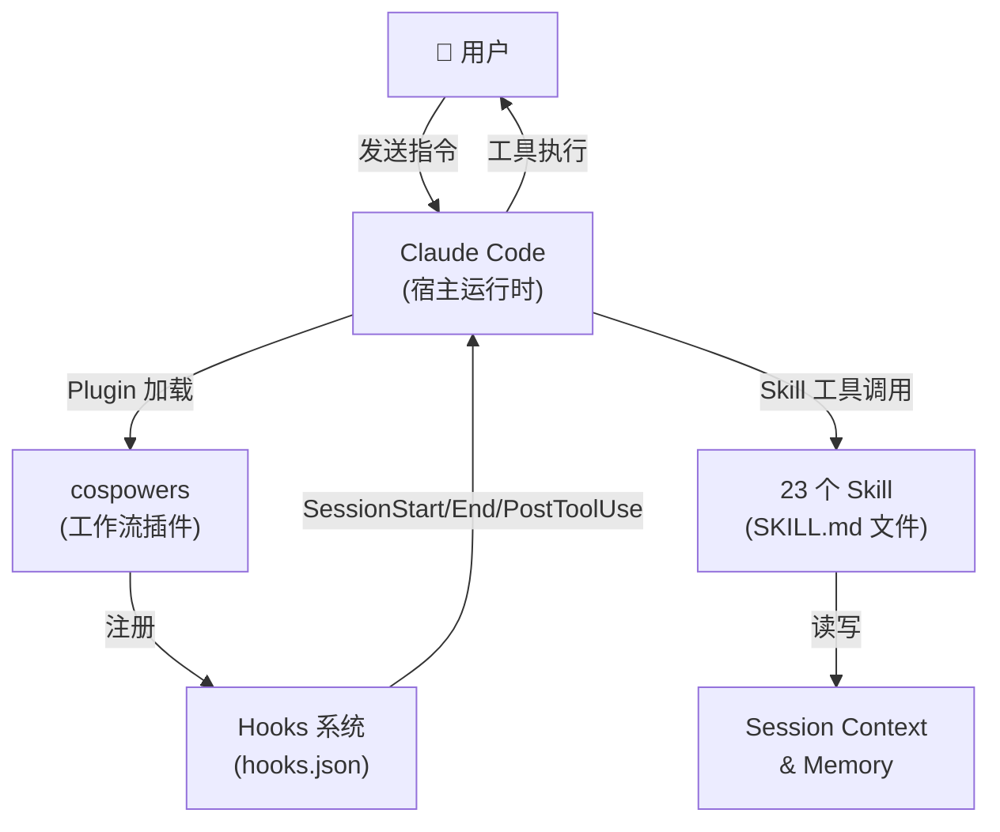
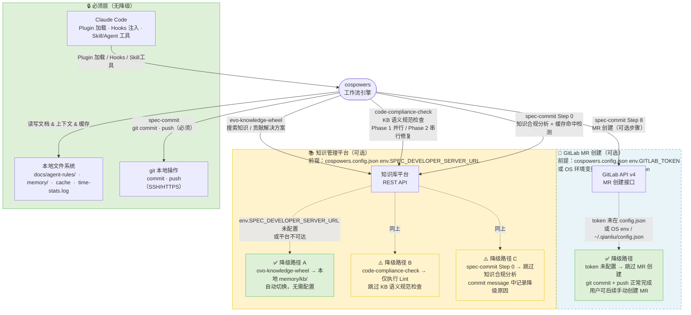

# cospowers 架构设计文档

> **文档定位：** 双层结构。第一层（Ch.1–5）为外部介绍材料，说明设计理念、整体路线和系统关系；第二层（Ch.6–11）为内部参考手册，逐组说明每个 Skill 的处理逻辑。
>
> **版本：** 2026-05-11 | 当前包含 28 个 Skill（23 核心 + 5 质量门控评估）

---

## 第一层：设计概览

---

## Ch.1 设计理念

cospowers 是一个运行在 Claude Code 之上的**工作流编排插件**，核心思想是将软件开发的最佳实践编码为可被 AI 主动调用的技能单元（Skill）。三个根本原则驱动了整个设计：

### 1.1 Skill-as-Code

每个 Skill 是一份 `SKILL.md` 文件，包含触发时机、硬性门控（HARD GATE）、处理流程和反模式列表。Skill 不是提示词，而是可被版本控制、可演进、可评审的**流程规约**。当 AI 调用 Skill 时，它将 Skill 内容加载为上下文指令，并严格按照其中的流程执行——这与调用函数在语义上等价。

### 1.2 AI-Native 流程编排

开发流程本身被设计为 AI 友好的：每个 Skill 清楚地声明前置条件、输出物、后继 Skill。AI 不需要猜测"下一步做什么"——Skill 的末尾会明确指示路由。整条链路从用户意图出发，经过需求 → 设计 → 规划 → 执行 → 验证 → 提交，每个环节都有质量门控，不能跳过。

### 1.3 规范内建（Spec-First）

提交、分支命名、commit message 格式、知识合规报告——这些规范不是文档里的建议，而是在 `spec-commit` Skill 中强制执行的 HARD GATE。规范违规会阻断流程，而不是产生警告。这确保了 AI 生成的代码和提交与人类开发的标准一致。

---

## Ch.2 系统定位

cospowers 是 **Claude Code 的工作流插件**，不是独立工具。它通过 Claude Code 的 Plugin 机制安装，依赖 Claude Code 的 hooks 系统完成生命周期事件注入，依赖 Claude Code 的 `Skill` 工具完成按需加载。



**关键约束：**
- Skill 文件只能通过 `Skill` 工具加载，AI 不直接读取 `SKILL.md`
- Hooks 在 Claude Code 进程层执行，不依赖 AI 上下文
- Memory 和 active 文件存储在本地文件系统，跨 session 持久化

---

## Ch.3 三条工作路线

`brainstorming` 是整个系统的**中央路由器**，在理解用户意图后评估项目类型，将流程分发到四条路线之一。所有路线最终汇聚到同一套提交层。

```mermaid
flowchart TD
    User(["👤 用户意图"])
    User --> Brain

    Brain(["brainstorming\n中央路由器\n高压追问 → 评估项目类型 → 路由"])

    Brain -->|"🔵 创新路线\n原型/单服务/小功能"| WP
    Brain -->|"🟢 增量路线 A\n无结构化需求文档"| RA
    Brain -->|"🟡 增量路线 B\n已有结构化需求文档"| SRA
    Brain -->|"🔴 排障路线\nBug/异常/测试失败"| SD

    %% 增量路线 A 专属阶段
    RA["requirement-analysis\n口头需求 → Epic / Feature / Story\n（14步）"]
    RA_EVAL["aireq-evaluator\n33条规则扫描（REQ-AI-01~33）\n+ 4红线 · 评分 < B 则返工"]
    RA --> RA_EVAL --> SRA

    %% 增量路线 A+B 共享的需求→设计阶段
    SRA["system-requirement-analysis\nREQ-XXX 编号 + Given-When-Then 验收标准\n（5 种场景类型覆盖）"]
    SRA_EVAL["sysreq-evaluator\n75条规则全量扫描\nREQ-01~38 + AIN-01~16 + FN-01~04 + IA-01~05 + SUP-01~09\n+ 3红线 · 评分 < B 则返工"]
    DS["overall-design-spec\n系统级设计文档 + OpenAPI Spec\n（⛔ OpenAPI 必须通过 HARD GATE）"]
    DS_EVAL["sysdesign-evaluator\nM1/M2/M3/M5/M6 + DFX/API规范 + 12 SYS-内置项\n+ 3红线 · 评分 < B 则返工"]
    SDS["module-design-spec\n子系统内部设计（每人独立调用一次）\n含时序图 / SQL DDL / 异常矩阵 / DFX"]
    SDS_EVAL["subsystem-evaluator\nM1/M4/M5/M6 + 模块设计规范 + 9 SUB-内置项 + FMEA\n+ 3红线 · 评分 < B 则返工"]
    DQ_EVAL["doc-quality-evaluator\n⚡ 仅最后一个子系统触发\nREQ追踪/方案一致/API契约/DFX数字/子系统边界\n5类跨文档检查 → pass/fail"]
    SRA --> SRA_EVAL --> DS --> DS_EVAL --> SDS --> SDS_EVAL --> DQ_EVAL --> WP

    %% 共享的规划层
    WP["writing-plans\n生成分步实施计划\n含代码规范约定 + 完整代码示例（无占位符）"]

    %% 共享的执行层
    WP -->|"推荐"| SDD
    WP -->|"备选"| EP
    SDD["subagent-driven-development\n每任务派发全新子 Agent\n双重门控：Spec合规 + 代码质量（各最多3轮）"]
    EP["executing-plans\n当前 session 顺序执行\n同样的逐任务 Review 门控"]

    %% 共享的质量守卫层
    SDD --> TDD
    EP --> TDD

    subgraph GUARD["质量守卫层（每任务执行一次循环）"]
        direction TB
        TDD["① test-driven-development\n先写失败测试 RED → 最小实现 GREEN → 重构 REFACTOR"]
        VBC["② verification-before-completion\n运行验证命令，展示实证输出\n禁止凭记忆声称通过"]
        CCC["③ code-compliance-check\nKB 语义规范检查 + Lint 自动修复\n通过后写入 compliance-cache.json"]
        RCR["④ requesting-code-review\n派发独立 code-reviewer 子 Agent\n检查代码结构 / 场景覆盖 / DFX"]
        TDD --> VBC --> CCC --> RCR
    end

    RCR --> SC

    %% 排障路线专属阶段
    SD["systematic-debugging\nPhase 1-3（只读）：5W1H 信息收集 → 假设排序 → 逐一验证\nPhase 4：根因确认后实施修复"]
    EKW(["evo-knowledge-wheel\n知识库搜索\n命中 Capsule/Recipe 直接复用"])
    TDD_D["test-driven-development\n为 Bug 编写回归测试"]
    VBC_D["verification-before-completion\n提供修复实证"]

    SD <-->|"Step 0\n内部子调用"| EKW
    SD --> TDD_D --> VBC_D --> SC

    %% 共享的提交层
    SC["spec-commit\n① 知识合规分析（并行检查/串行修复）\n② 保护分支检测 → 新建分支\n③ 逐文件暂存 → 14段 Message\n④ Pre-commit Hook → Commit → Push → 可选建 MR"]
    FIN["finishing-a-development-branch\n合并 / 创建 PR / 清理分支"]
    SC --> FIN

    %% 样式
    style RA fill:#e8f4f8,stroke:#5b9bd5
    style RA_EVAL fill:#e8f4f8,stroke:#5b9bd5,stroke-dasharray:4 2
    style SRA fill:#dff0d8,stroke:#5cb85c
    style SRA_EVAL fill:#dff0d8,stroke:#5cb85c,stroke-dasharray:4 2
    style DS fill:#dff0d8,stroke:#5cb85c
    style DS_EVAL fill:#dff0d8,stroke:#5cb85c,stroke-dasharray:4 2
    style SDS fill:#dff0d8,stroke:#5cb85c
    style SDS_EVAL fill:#dff0d8,stroke:#5cb85c,stroke-dasharray:4 2
    style DQ_EVAL fill:#dff0d8,stroke:#5cb85c,stroke-dasharray:4 2
    style SD fill:#fde8e8,stroke:#d9534f
    style EKW fill:#fde8e8,stroke:#d9534f
    style TDD_D fill:#fde8e8,stroke:#d9534f
    style VBC_D fill:#fde8e8,stroke:#d9534f
    style GUARD fill:#f9f9e8,stroke:#e6c800
    style SC fill:#2d2d2d,color:#ffffff,stroke:#000000
    style FIN fill:#2d2d2d,color:#ffffff,stroke:#000000
```



**路线对照说明：**

| 路线 | 触发条件 | 专属阶段 | 质量门控 | 汇入点 |
|---|---|---|---|---|
| 🔵 创新路线 | 绿地项目、原型、单服务、模块 < 3 个 | 无（brainstorming 直接产出设计） | 无 | writing-plans |
| 🟢 增量路线 A | 企业多服务项目，用户只有口头需求或非正式 PRD | requirement-analysis → system-requirement-analysis → overall-design-spec → module-design-spec | aireq-evaluator → sysreq-evaluator → sysdesign-evaluator → subsystem-evaluator → doc-quality-evaluator | writing-plans |
| 🟡 增量路线 B | 产品团队已有结构化需求文档（含编号、验收标准等） | system-requirement-analysis → overall-design-spec → module-design-spec（跳过 requirement-analysis） | sysreq-evaluator → sysdesign-evaluator → subsystem-evaluator → doc-quality-evaluator | writing-plans |
| 🔴 排障路线 | Bug、测试失败、非预期行为 | systematic-debugging（内含 evo-knowledge-wheel） | 无独立评估器 | spec-commit（[FIX] 类型） |

**增量路线文档交付链：**
`1-ai-requirements/` → `2-system-requirements/` → `3-system-design/` → `4-module-design/` → `plans/`

---

## Ch.4 与外部系统的关系图

每个外部系统标注了**接入它的具体 Skill**、**所需的配置前提**，以及**当系统不可达时的降级策略**。绿色节点 = 降级后仍可运行的替代路径；黄色节点 = 部分功能降级。



**集成状态速查表：**

| 外部系统 | 接入 Skill | 前提条件 | 系统不可达时的降级行为 |
|---|---|---|---|
| Claude Code | 全部 Skill | 必须（宿主运行时） | 无法运行，无降级 |
| 本地文件系统 | session-context、writing-plans、executing-plans 等 | 必须（本地磁盘） | 无法运行，无降级 |
| git（commit/push） | spec-commit | 必须（git 已安装） | 无法提交代码，无降级 |
| 知识库平台 | evo-knowledge-wheel、code-compliance-check、spec-commit（Step 0） | `cospowers.config.json` → `env.SPEC_DEVELOPER_SERVER_URL`（或同名 OS 环境变量） | 三段独立降级（见图中路径 A/B/C） |
| GitLab MR 创建 | spec-commit（Step 8） | `cospowers.config.json` → `env.GITLAB_TOKEN` / `env.GITLAB_TOKEN_PATH`（或 OS 环境变量 / `~/.qianliu/config.json`） | 跳过 MR 创建，commit/push 不受影响 |

---

## Ch.5 运行时机制

### 5.1 Hooks 系统

cospowers 通过 `hooks/hooks.json` 在 Claude Code 的四个生命周期事件中注入行为：

| Hook 事件 | 触发时机 | 执行脚本 | 核心作用 |
|---|---|---|---|
| `SessionStart` | session 启动 / `/clear` / context compact | `session-start` | 注入 session-context skill，触发 AI 盘点已有 active-*.md 并恢复上下文 |
| `SessionEnd` | session 结束 | `session-end` | 触发 AI 执行最终 checkpoint，提议沉淀任务经验到 memory |
| `PostToolUse` (Skill) | 任何 Skill 被调用后 | `skill-usage-report` | 记录 Skill 使用统计，用于分析哪些 Skill 被频繁使用 |
| `UserPromptSubmit` | 用户每次提交消息 | `usage-report` | 记录会话使用数据 |

### 5.2 上下文持久化模型

session-context Skill 实现跨 session 的知识保留，采用**即时写入 + hook 读写**双机制：

```
用户纠正 AI / 完成任务步骤 / 架构决策
        ↓ ENFORCE-IMMEDIATE-WRITE（立刻写，不等 compact）
  active-<task>.md（任务进度，临时）
        ↓
  context compact 发生（上下文窗口缩小）
        ↓
  SessionStart hook → 加载 session-context → AI 盘点 active-*.md → 恢复状态
        ↓
  任务结束 → "沉淀" → 有价值经验写入 memory/ → 删除 active-*.md
```

**两层知识：**
- `active-<task>.md`：当前任务的临时备忘，任务完成后删除
- `memory/`：跨任务的永久积累（feedback、project、user、reference 四类）

### 5.3 知识合规缓存传递链

`code-compliance-check` 在执行阶段检查完规范后，将结果写入缓存。`spec-commit` 在提交阶段读取这份缓存，避免重复检查同一份规范文档：

```
executing-plans / subagent-driven-development
        ↓（每任务完成后）
  code-compliance-check（KB 语义检查 + lint 自动修复）
        ↓
  写入 docs/agent-rules/cospowers/output/compliance-cache.json
        ↓
  spec-commit Step 0（知识合规分析）
        ↓
  读取 compliance-cache.json
  → 缓存有效（HEAD 未变、< 24h）→ 跳过已检查文档
  → 缓存无效（新 commit / 过期）→ 全量检查
```

### 5.4 时间打点传递链

三个角色通过 `time-stats.log` 传递时间数据，用于 commit message 中的 `[TIME-STATS]` 块：

| 打点 | 写入者 | 时机 |
|---|---|---|
| `T_TASK_START` | writing-plans | 计划生成完成时 |
| `T_EXEC_START` | executing-plans / subagent-driven-development | 开始第一个任务前 |
| `T_FIRST_COMPLETE` | executing-plans / subagent-driven-development | 所有任务完成后 |

### 5.5 扩展配置机制

所有可定制点统一收口在插件根目录的 `cospowers.config.json`。每个 skill 在启动时读取该文件，用其中的值替换内置默认值，**无需修改任何 skill 文件**。

```
cospowers.config.json
  ├── env.*          → 服务端点与凭据（优先于同名 OS 环境变量）
  ├── kb.*           → 知识库 skill 名 / 本地路径
  ├── templates.*    → 各阶段文档模板文件路径
  ├── rules.*        → 规范目录路径（design-review / coding-standards / dfx）
  └── evaluators.*   → 质量门控 skill 名（false = 禁用该 Gate）
```

**读取优先级（每个字段）：**

```
cospowers.config.json 中非 null 值 → OS 环境变量（env 块向后兼容）→ cospowers 内置默认值
```

文件已内置完整默认值，开箱即用。需要定制时运行 `cospowers-configure` skill 进行交互式引导。

---

---

## 第二层：Skill 参考手册

> 以下各章按功能组组织，每个 Skill 说明：触发时机、核心处理逻辑、主要输入输出、上下游依赖。

---

## Ch.6 入口组 Skill

### 6.0 `cospowers-configure`

**触发时机：** 用户需要自定义 cospowers 行为时显式调用——替换规范目录、模板文件、评估器 skill、KB 地址、凭据等。

**核心逻辑（交互式向导）：**
1. 读取当前 `cospowers.config.json`，展示已配置项与默认项
2. 询问用户要配置哪个类别（env / kb / templates / rules / evaluators）
3. 逐项询问，每项给出推荐答案；用户提供路径/skill名后立即验证（路径用 Read/Glob 检查，skill 名检查已安装列表）
4. 将变更 merge 写入 `cospowers.config.json`，展示变更摘要

**Plugin Isolation 声明：** `cospowers.config.json` 是唯一支持的扩展入口。cospowers 核心流程 skill（brainstorming、spec-commit、writing-plans 等骨架 skill）的 SOP 不可被其他 plugin 覆盖；只有 config 中声明的叶子扩展点（evaluators、templates、rules、kb、env）可替换。

**输入输出：**
- 输入：用户交互 + 当前 `cospowers.config.json`
- 输出：更新后的 `cospowers.config.json`；配置立即生效，无需重启

**参考：** `skills/cospowers-configure/references/config-schema.md`

---

### 6.0b `env-conflict-checker`

**触发时机：** 用户显式调用，检查当前环境是否存在与 cospowers 冲突的外部 skill 或配置指令。触发词："检查环境冲突"、"env check"、"冲突检测"、"环境诊断"。

**核心逻辑（只读诊断，不自动修改）：**

**Phase 1 — 环境扫描：**
- 从 system prompt 枚举所有已安装 skill；带 `cospowers:` 前缀的为基线，其余为外部 skill 候选
- 同名去重：无前缀名与 `cospowers:<name>` 完全一致 → 标记为 SAME_SKILL，排除分析
- 读取 `references/spec-domains.yaml`（9 个能力域定义）和 `references/config-files.yaml`（配置文件扫描目标）

**Phase 2 — 三级深度冲突分析（仅外部 skill）：**

| 层级 | 检查内容 | 结论 |
|---|---|---|
| L1 关键词匹配 | skill 名/描述 vs 能力域关键词 | 无匹配 → NO_CONFLICT |
| L2 触发条件对比 | 外部 skill 触发场景 vs cospowers 同域 skill | 场景不同 → INFO |
| L3 工作流内容对比 | 读取外部 skill 全文，检查是否绕过/矛盾 cospowers 流程 | 直接矛盾 → BLOCKER；可共存 → WARN |

**Phase 3 — 配置文件扫描：** 检查 CLAUDE.md、AGENTS.md、settings.json 等是否包含覆盖 cospowers 优先级、绕过工作流步骤、禁用核心 skill 等指令。

**Phase 4 — 输出报告：** 按 🔴 BLOCKER / 🟡 WARN / 🔵 INFO 分级输出，每项附具体冲突说明和可执行的处置建议（以代码块形式提供，不自动执行）。

**HARD GATE：** 只读。不自动修改任何文件、禁用任何 skill、变更任何配置。所有处置动作需用户明确确认后方可执行。

**上游：** 用户直接触发
**下游：** 无（诊断结束）

---

### 6.1 `using-spec-developer`

**触发时机：** 每次 session 开始，作为 AI 行为指南自动加载（通过 SessionStart hook 注入）。

**核心逻辑：**
- 声明 Skill 优先级规则：用户指令 > cospowers Skill > 默认系统行为
- 提供 Skill 使用决策树：收到用户消息 → 判断是否有 1% 可能涉及某个 Skill → 必须先调用再响应
- 列举"合理化逃避"的红旗（Red Flags）以防 AI 跳过流程

**关键约束：** AI 在响应任何消息（包括澄清问题）之前，必须先完成 Skill 检查。

---

### 6.2 `session-context`

**触发时机：** SessionStart / SessionEnd hook、context compact 事件、用户说"保存上下文"/"沉淀"/"checkpoint"。

**核心逻辑（盘点流程）：**
1. 读取 `references/agent-paths.md` 确定平台路径
2. `ls` 枚举 memory 目录 + 所有 `active-*.md`
3. 读取 `MEMORY.md` 及所有引用的记忆文件
4. 判断是否恢复旧任务：有 active-*.md 且与当前意图相关 → 恢复；否则 → 新任务
5. 执行变更影响矩阵：用户纠正 → 写 feedback memory；架构决策 → 写 project memory

**输入输出：**
- 输入：本地 `active-*.md`、`memory/` 目录
- 输出：更新后的 `active-<task>.md`、memory 文件

**HARD GATE：** 关键事件（用户纠正、任务完成、架构决策）发生时必须在同一回复中立即写入，禁止延迟。

---

### 6.3 `brainstorming`

**触发时机：** 所有创意/开发工作之前强制调用——创建功能、构建组件、修改行为、排障。

**核心逻辑（11 步流程）：**

1. **恢复会话上下文**（如有）：若 `active-*.md` 存在，先调用 session-context 完成盘点
2. **探索项目上下文**：检查文件、文档、最近提交；通过 evo-knowledge-wheel 搜索团队知识库；读取 `docs/agent-rules/specs/` 中已有设计文档（了解既有决策和术语）；读取 `memory/` 中沉淀的项目经验
3. 可选：提供可视化伴侣（浏览器内展示 mockup / 图表）
4. **高压追问（Grill the idea）**：逐枝遍历设计决策树，每个问题必须附带推荐答案，等待反馈后再继续；同步应用四种追问技法（见下）
5. **评估复杂度并路由**（关键分叉点）：
   - 创新/单服务 → 继续步骤 6-11
   - 增量项目 A（无需求文档）→ 立即调用 requirement-analysis，停止
   - 增量项目 B（已有需求文档）→ 立即调用 system-requirement-analysis，停止
   - 排障 → 立即调用 systematic-debugging，停止
6. 提案 2-3 种方案（含 DFX 6 维度评估）
7. 分节展示设计，逐节获取用户确认
8. 写设计文档到 `docs/agent-rules/specs/YYYY-MM-DD-<topic>-design.md`
9. Spec 自检（扫描占位符、内部一致性、范围、歧义）+ 派发子 Agent 评审
10. 等待用户评审并确认，提交设计文档
11. 调用 writing-plans

**四种高压追问技法：**

| 技法 | 做什么 |
|---|---|
| **术语挑战** | 发现模糊或与已有设计冲突的术语时立即叫停，提出精确候选词；术语确定后写入 `active-*.md`，并在设计文档开头章节定义 |
| **场景压测** | 讨论领域关系时，构造具体边界场景逼出精确定义；不接受"大概是这样"的回答 |
| **代码交叉验证** | 用户陈述机制时先查代码确认；发现矛盾立即指出："你说支持部分取消，但代码里取消的是整个订单——哪个对？" |
| **ADR 三条件门控** | 满足以下三条才建 ADR：① 难以逆转 ② 没有上下文会令人困惑 ③ 真实取舍（有备选方案且选择有具体理由）；ADR 存放 `docs/agent-rules/specs/adr/NNNN-<slug>.md`，格式遵循 `skills/brainstorming/ADR-FORMAT.md` |

**HARD GATE：** 在展示设计并获得用户批准之前，禁止进行任何实现、写代码、搭建项目等动作。

**上游：** using-spec-developer（触发检查）
**下游：** requirement-analysis / system-requirement-analysis / systematic-debugging / writing-plans

---

## Ch.7 需求分析组 Skill

### 7.1 `requirement-analysis`

**触发时机：** brainstorming 识别为增量项目 A（用户只有口头描述或非正式 PRD）时调用。

**核心逻辑（14 步）：**
1. 收集背景情报（通过 init-aireq-template.md 结构化表单）
2. 查询产品知识库（如配置了 kb-query）
3. 探索项目上下文和代码库
4. 加载 Epic/Feature/Story 模板
5. 阅读所有输入材料（不立即分解）
6. 逐一澄清模糊需求
7. 确认是否有补充材料
8. 对材料分级（权威/参考/孤立）
9. **分解为 Epic → Feature → Story 三层结构**（以用户为中心的语言）
10. 展示分解树，获取用户确认
11. 写 `YYYY-MM-DD-<project>-requirements.md`
12. 快速预检（结构完整性扫描）
13. 派发 aireq-evaluator 子 Agent（33 条规则扫描，评分 < B 则返工）
14. 用户评审确认

**输出：** `docs/agent-rules/1-ai-requirements/output/YYYY-MM-DD-<project>-requirements.md`
**下游：** system-requirement-analysis

---

### 7.2 `system-requirement-analysis`

**触发时机：** 两个入口：(A) requirement-analysis 完成后；(B) brainstorming 识别为增量路线 B（已有结构化需求文档）时直接调用。

**核心逻辑：**
- 深化 Epic/Feature/Story 或结构化需求文档为正式系统需求文档
- 为每个功能点生成 `REQ-XXX` 编号
- 使用 Given-When-Then 格式覆盖 5 种场景类型（正常/边界/异常/性能/安全）
- 产出设计任务书（各 REQ 分配到子系统负责人）

**两级 Review 门控：**

| 级别 | 执行方式 | 检查内容 | 阻断条件 |
|---|---|---|---|
| **第一级（轻量）** | 派发子 Agent，使用 `agents/system-requirement-reviewer-prompt.md` | 阻断级缺陷：缺失章节、REQ 未覆盖、DFX 章节为空、章节间数值矛盾 | 发现任何阻断级问题即修复后继续 |
| **第二级（质量 Gate）** | 派发 `sysreq-evaluator` 子 Agent | 75 条规则全量扫描：REQ-01~38（核心质量）+ AIN-01~16（AI-Native 质量）+ FN-01~04（功能性）+ IA-01~05（交互设计）+ SUP-01~09（补充质量） | 评分 < B（< 80）→ 修复后重评，不得跳过 |

**输出：** `docs/agent-rules/2-system-requirements/output/YYYY-MM-DD-<project>/`（多章节文件：ch01~ch09）
**下游：** overall-design-spec

---

## Ch.8 设计组 Skill

### 8.1 `overall-design-spec`

**触发时机：** system-requirement-analysis 完成，需要系统级设计文档时。

**核心逻辑（两阶段产出，顺序强制）：**

**阶段一：系统级设计文档**（按 `templates/system-design-template.md`，7 个子文档）
- 加载系统需求文档，扫描所有 REQ-XXX 和 DFX 项
- 通过 init-sysdesign-template.md 收集已有架构约束（现有服务、不可改动的表、外部集成、本地代码路径）
- **HARD GATE**：§1（现有架构图）和 §2（历史设计文档）至少提供一项，否则无法识别现有子系统边界，阻断执行
- 读取本地服务代码（§8 代码路径），理解现有实现模式后再提出架构方案
- 产出：系统架构图（Mermaid ⭐必填）、子系统分解、跨子系统交互流程、系统级 DFX（7 维度）
- 有增量对齐检查点（架构 / 数据架构 / DFX / 部署），每个检查点暂停等待用户确认后再继续

**阶段二：OpenAPI Spec**（按 `templates/openapi-template.yaml`）
- 先展示端点清单获取用户确认，再写完整 schema
- **HARD GATE（Step 9a 自检）**：文件存在 + YAML 合法 + 每个子系统至少一个端点 + 所有 `$ref` 可解析，任一失败阻断

**两级 Review 门控：**

| 级别 | 执行方式 | 检查内容 | 阻断条件 |
|---|---|---|---|
| **第一级（轻量）** | 派发子 Agent，使用 `agents/design-document-reviewer-prompt.md` | 完整性（REQ 是否全部追溯到设计）、可信度（伪精确数字、章节矛盾）、接口覆盖 | 发现问题即修复 |
| **第二级（质量 Gate）** | 派发 `sysdesign-evaluator` 子 Agent | 从规范文件动态加载检查项：M1（文档书写规范）+ M2（技术需求设计）+ M3（总体设计）+ M5（i18n）+ M6（不贰过）+ DFX安全/性能标准 + API规范；另有 12 条 SYS- 内置检查项（架构差距量化/性能测试完整性/容量边界/分布式一致性/DR计划/限流熔断/可调试性/可监控性等）；3 条红线（章节完整性/可靠性/安全性）；5 维度加权评分（技术可行性30% + 需求完整性25% + 可测试性20% + 规范符合性15% + 架构合理性10%） | 评分 < B（< 80）→ 修复后重评 |

**输出：** `docs/agent-rules/3-system-design/output/YYYY-MM-DD-<project>/`（7 子文档 + openapi.yaml）
**下游：** module-design-spec

---

### 8.2 `module-design-spec`

**触发时机：** overall-design-spec 完成后，每个子系统负责人独立调用一次（一次调用 = 一个子系统）。

**核心逻辑：**
- 读取系统设计文档 + OpenAPI Spec（**HARD GATE**：OpenAPI 文件必须存在、合法、有端点）
- 展示子系统列表，用户确认负责哪个子系统
- 通过 init-{subsystem}-subsystem.md 收集实现约束：
  - §1（代码仓库/语言）**阻断必填**
  - §4（技术债务）**阻断必填**（明确写"无"也算，空白不可接受）
- 按 `templates/module-design-template.md` 产出，含对齐检查点（接口边界 / 内部设计 / 全量审阅）
- 产出内容：子系统职责边界、对外接口（引用 OpenAPI，不复制）、内部流程（Mermaid 时序图含 alt/else 分支）、数据结构（SQL DDL）、异常处理矩阵、DFX 覆盖

**两级 Review 门控 + 跨文档检查：**

| 级别 | 执行方式 | 检查内容 | 触发时机 |
|---|---|---|---|
| **第一级（轻量）** | 派发子 Agent，使用 `agents/design-document-reviewer-prompt.md` | 完整性（REQ 追溯）、可信度（伪精确数字、矛盾）、接口边界 | 每次子系统设计完成后 |
| **第二级（质量 Gate）** | 派发 `subsystem-evaluator` 子 Agent | 从规范文件动态加载检查项：概要设计 checklist（含5项裁剪适配）+ 模块设计规范 + M1/M4/M5/M6；另有 9 条 SUB- 内置检查项（对外接口完整性/异常三要素/日志设计/缓存一致性/N+1检测/并发控制/测试隔离/扩展点规范/需求覆盖）；FMEA 分析表专项（功能分析/失效分析/SOD评分/AP优先级/改进措施）；3 条红线（章节完整性/可靠性/安全性）；5 维度加权评分（技术可行性35% + 可测试性25% + 需求完整性20% + 规范符合性15% + 架构合理性5%） | 每次子系统设计完成后 |
| **跨文档一致性** | 派发 `doc-quality-evaluator` 子 Agent | 5 类跨文档检查：① REQ 追踪（需求→设计追溯表）② 技术方案一致性（系统设计选型→子系统设计体现）③ API 契约一致性（OpenAPI 定义↔子系统接口引用）④ DFX 指标一致性（需求/特性级总体设计/子系统设计三份文档数字必须完全一致）⑤ 子系统边界一致性（职责定义↔子系统设计描述）；输出 pass/fail，失败则修复后重触发 | **仅在所有子系统设计全部完成后**，由最后完成的负责人触发一次 |

**输出：** `docs/agent-rules/4-module-design/output/YYYY-MM-DD-<project>/<subsystem>/`
**下游：** writing-plans（单子系统）或等待其他子系统完成后统一触发 doc-quality-evaluator

---

## Ch.9 规划执行组 Skill

### 9.1 `writing-plans`

**触发时机：** 设计文档完成后（创新路线：brainstorming 设计批准后；增量路线：module-design-spec 完成后）。

**核心逻辑：**

**来源检测（自动判断模式）：**
- 扫描 `docs/agent-rules/4-module-design/output/` → 找到 → **子系统模式**（每服务一份计划）
- 否则扫描 `docs/agent-rules/3-system-design/output/` → 找到 → **系统模式**（单份计划）

**代码库风格分析（强制）：** 写计划前必须分析现有代码的命名规范、错误处理、测试框架等，计划中的代码示例必须与现有代码风格一致。

**计划结构：** 每个任务包含文件列表（创建/修改/测试）+ 分步骤（每步 2-5 分钟）+ 完整代码（无占位符）+ 预期输出。

**OpenAPI HARD GATE（子系统模式）：** 计划开始前必须验证 OpenAPI 文件存在、YAML 合法、至少有一个端点。

**执行交接：** 计划完成后提供两种执行方式选择（subagent-driven-development 推荐 / executing-plans 内联）。

**输出：** `docs/agent-rules/plans/YYYY-MM-DD-<feature>.md`（系统模式）或 `docs/agent-rules/plans/YYYY-MM-DD-<project>/<service>-plan.md`（子系统模式）

---

### 9.2 `executing-plans`

**触发时机：** 用户选择内联执行时，writing-plans 调用。

**核心逻辑（3 步）：**

**Step 1：加载并评审计划** — 读取计划文件，识别问题，创建 TodoWrite 任务列表。

**Step 2：逐任务执行**（每任务含 8 个子步骤）：
1. 标记任务进行中
2. 读取代码规范约定（计划头部）
3. TDD 循环（RED → GREEN → REFACTOR）
4. verification-before-completion（运行测试，提供证据）
5. Spec 合规评审（对比计划要求逐行检查，最多 3 轮）
6. code-reviewer 子 Agent（code quality review，最多 3 轮）
7. code-compliance-check（KB 语义 + lint，写 compliance-cache.json）
8. spec-commit（AI 标签、结构化 message）

**Step 3：完成** — 记录 T_FIRST_COMPLETE → 派发 final code-reviewer → 运行完整测试套件 → finishing-a-development-branch。

---

### 9.3 `subagent-driven-development`

**触发时机：** 用户选择子 Agent 执行时（推荐路径），writing-plans 调用。

**核心逻辑：** 每个任务派发一个**全新的、上下文隔离的子 Agent**（通过 `Agent` 工具）：

```
读取计划 → 创建 TodoWrite
    ↓（每任务）
派发 implementer 子 Agent（agents/implementer-prompt.md）
    ↓
Gate 1：派发 spec-reviewer 子 Agent（规格合规，最多 3 轮）
    ↓
Gate 2：派发 code-quality-reviewer 子 Agent（代码质量，最多 3 轮）
    ↓
verification-before-completion（证据）
    ↓
标记任务完成 → 下一任务
    ↓（所有任务完成后）
派发 final code-reviewer（全量 diff）
    ↓
运行完整测试套件
    ↓
finishing-a-development-branch
```

**核心原则：** 子 Agent 没有当前 session 的历史上下文，orchestrator 必须精确构造它们所需的一切信息。

---

### 9.4 `using-git-worktrees`

**触发时机：** 功能开发开始前需要隔离工作空间时，或用户明确说"worktree"时。

**核心逻辑：** 在 `.claude/worktrees/` 下创建独立的 git worktree，将 session 工作目录切换到新 worktree，确保开发工作不影响主分支。包含目录选择智能（避免 symlink 问题）和安全验证。

---

## Ch.10 质量保证组 Skill

### 10.1 `test-driven-development`

**触发时机：** 实现任何功能或 bugfix 之前强制调用（由 executing-plans / subagent-driven-development 在每个任务中触发）。

**核心逻辑：** 严格的红绿重构循环：
1. **RED：** 先写失败的测试（必须覆盖正常/边界/异常场景）
2. **验证失败：** 运行测试确认它为预期原因失败（不是 import 错误等）
3. **GREEN：** 写最小实现使测试通过
4. **验证通过：** 运行测试确认通过，且其他测试仍通过
5. **REFACTOR：** 清理代码，保持测试绿色

**反模式：** 禁止先写代码再补测试、禁止只写快乐路径、禁止 mock 核心业务逻辑。

---

### 10.2 `test-code-generator`

**触发时机：** 基于测试用例文档生成测试代码时（通常在 executing-plans 中）。

**核心逻辑：** 读取测试用例文档 → 构造真实格式的测试数据（真实 UUID、业务名称，非 "test_xxx"）→ 生成符合项目规范的 go test / pytest 测试代码，覆盖多种业务场景。

---

### 10.3 `verification-before-completion`

**触发时机：** 声称任何工作完成、修复通过、测试通过之前强制调用。

**核心逻辑（铁律）：** 必须在当前回复中运行验证命令并展示输出，才能声称通过。验证命令不能是"上次运行"的结果——必须是当前消息中新运行的。

**GATE 函数：**
- C1：新测试文件通过
- C2：关联模块的现有测试通过
- 两个条件都满足才能声称完成

---

### 10.4 `requesting-code-review`

**触发时机：** 完成实现任务后、合并前，由 executing-plans / subagent-driven-development 调用。

**核心逻辑：** 派发独立的 `code-reviewer` 子 Agent（使用 `agents/code-reviewer.md` prompt），对 `git diff` 范围内的变更进行独立评审，检查代码结构、测试质量、场景覆盖、容错、DFX 约束。评审结果为 PASS 或 FAIL（含具体问题列表）。

---

### 10.5 `code-compliance-check`

**触发时机：** git commit 之前，由 executing-plans / subagent-driven-development 在每任务末尾调用。

**核心逻辑（两阶段）：**
- **KB 语义检查：** 从知识库拉取当前语言的规范文档，逐文档派发 `kb-compliance-checker` 子 Agent 检查 git diff；有可修复违规 → 串行修复（避免并发写冲突）；有阻断违规 → 人工决策
- **Lint 自动修复：** 运行语言对应的格式化工具（gofmt、black、eslint 等）
- **写缓存：** 检查通过后写入 `compliance-cache.json`，供 spec-commit Step 0 跳过重复检查

---

## Ch.11 知识与提交组 Skill

### 11.1 `evo-knowledge-wheel`

**触发时机：** 遇到技术问题、实现通用模式、用户描述曾遇到的问题时，在正式调查或实现之前先调用。

**核心逻辑（双模式）：**

**远程模式**（`SPEC_DEVELOPER_SERVER_URL` 已配置）：
1. 优先搜索本地知识库（`doc/kb/` → `agent-rules/kb/` → Skills）
2. 读取节点档案（`~/.claude/.evo_node_profile.json`）
3. 提取中文搜索关键词（强制中文，禁止翻译为英文）
4. 搜索远程 Hub（Capsule → Recipe → Gene → 无匹配）
5. 按结果类型处理（直接应用 / 执行 Recipe 步骤 / 基于 Gene 生成实现）
6. 记录消费事件（更新节点进化状态）

**本地降级模式**（无 `SPEC_DEVELOPER_SERVER_URL`）：
- 搜索 `memory/kb/` 目录下的本地知识文件
- 知识贡献写入 `memory/kb/<topic-slug>.md` + 更新 `INDEX.md`

**贡献规则（仅在满足条件时才贡献）：** 问题属于 Bug/配置陷阱/框架未文档用法 AND 解决过程需要用户多次指导或 AI 多次失败 → 才贡献到 Hub。

---

### 11.2 `systematic-debugging`

**触发时机：** 遇到任何 Bug、测试失败、非预期行为时，brainstorming 路由后立即调用。

**核心逻辑（铁律：找到根因前禁止修复）：**

**Step 0：** 先搜索知识库（evo-knowledge-wheel）——已知解直接应用。

**四个阶段（必须按顺序，Phase 1-3 只读）：**
- **Phase 1：** 5W1H 信息收集（What/When/Where/Who/Why/How），建立症状基线
- **Phase 2：** 假设生成与排序（按置信度排序，证据不足时停止并询问）
- **Phase 3：** 逐假设验证（实证方法：日志/DB 查询/API 响应，禁止猜测）
- **Phase 4：** 根因确认后实施修复（调用 TDD 为 Bug 写回归测试）

**证据层次（严格遵守）：**
真实数据（日志/API 响应）> 代码分析 > 文档 > 经验猜测

---

### 11.3 `spec-commit`

**触发时机：** 任何 git commit / git push / 创建 MR 操作时。

**核心逻辑（8 步自动化流程）：**

```
Step 0: 知识合规分析（检查 KNOWLEDGE_URL / 读缓存 / 并行检查 / 串行修复）
    ↓
Step 1: 收集上下文（git status/diff/branch/log + Agent-Rules 版本检测）
    ↓
Step 2: 保护分支检测（main/master/develop/release/*/m-feature-* 禁止直接提交）
    ↓
Step 3: 创建新分支（保护分支时强制，分支名 ≤ 50 字符）
    ↓
Step 4: 逐文件暂存（禁止 git add -A，排除敏感文件和 agent-rules/ 目录）
    ↓
Step 5: 组装 Commit Message（14 段模板：问题描述/改动思路/影响分析/测试/合规报告等）
    ↓
Step 6: Pre-Commit Hook 检查
    ↓
Step 7: 执行 Commit（HEREDOC 格式保证格式化）
    ↓
Step 8: 询问推送 → 可选创建 MR（动态提取 GitLab 域名，读 token from ~/.qianliu/config.json）
```

**AI 标签规则：** 默认 `[AI-COMMIT]`；角色扩展可指定 `[AI-SPEC-FIRST]` 等专属标签（角色扩展优先）。

**知识合规报告（Step 0 输出）：** commit message 中必须包含"涉及 N 篇规范文档，检查 M 条规则，通过 X / 未涉及 Y / 违规 Z"的结构化报告；无法访问知识库时必须注明降级原因。

**保护措施：** 禁止 `git push origin main/master/develop`、禁止 `--force`、禁止 `git add -A`、禁止自动 push（须用户确认）。

---

### 11.4 `finishing-a-development-branch`

**触发时机：** 所有实现完成、测试通过、需要决定如何集成时，由 executing-plans / subagent-driven-development 末尾调用。

**核心逻辑：** 验证测试通过 → 展示三种选项（直接合并 / 创建 PR / 清理并放弃）→ 执行用户选择。

---

### 11.5 `mcp-builder`

**触发时机：** 用户需要构建 MCP（Model Context Protocol）服务器，集成外部 API 或服务时。

**核心逻辑：** 提供 Python（FastMCP）和 Node/TypeScript（MCP SDK）两种实现路径的指导：工具设计原则、错误处理规范、评估方法、最佳实践。

---

## 附录：Skill 依赖矩阵

| Skill | 直接调用 | 被谁调用 |
|---|---|---|
| `using-spec-developer` | — | SessionStart hook（自动注入） |
| `cospowers-configure` | cospowers.config.json（读写）; 验证路径/skill存在性 | 用户直接触发 |
| `env-conflict-checker` | system prompt skill 列表（只读）; 外部 skill SKILL.md（只读）; 配置文件（只读） | 用户直接触发 |
| `brainstorming` | requirement-analysis, system-requirement-analysis, systematic-debugging, writing-plans, evo-knowledge-wheel（探索阶段）; 写入 `docs/agent-rules/specs/adr/` | using-spec-developer（路由触发） |
| `requirement-analysis` | system-requirement-analysis, **aireq-evaluator**（质量 Gate） | brainstorming |
| `system-requirement-analysis` | overall-design-spec, **sysreq-evaluator**（质量 Gate） | brainstorming, requirement-analysis |
| `overall-design-spec` | module-design-spec, **sysdesign-evaluator**（质量 Gate） | system-requirement-analysis |
| `module-design-spec` | writing-plans, **subsystem-evaluator**（质量 Gate）, **doc-quality-evaluator**（最后子系统触发） | overall-design-spec |
| `writing-plans` | executing-plans, subagent-driven-development | brainstorming, module-design-spec |
| `executing-plans` | test-driven-development, verification-before-completion, requesting-code-review, code-compliance-check, spec-commit, finishing-a-development-branch | writing-plans（用户选择） |
| `subagent-driven-development` | test-driven-development, verification-before-completion, requesting-code-review, code-compliance-check, spec-commit, finishing-a-development-branch（通过 Agent 工具派发） | writing-plans（用户选择） |
| `spec-commit` | evo-knowledge-wheel（知识合规）, GitLab MR API | executing-plans, subagent-driven-development |
| `evo-knowledge-wheel` | knowledge Hub API（远程）或 memory/kb/（本地） | systematic-debugging, spec-commit, brainstorming |
| `systematic-debugging` | evo-knowledge-wheel, test-driven-development, spec-commit | brainstorming |
| `session-context` | memory/ 文件系统 | SessionStart/End hook |
| `code-compliance-check` | kb-compliance-checker 子 Agent, lint 工具 | executing-plans, subagent-driven-development |
| `requesting-code-review` | code-reviewer 子 Agent | executing-plans, subagent-driven-development |
| `verification-before-completion` | 测试运行命令 | executing-plans, subagent-driven-development |
| `finishing-a-development-branch` | git 工具 | executing-plans, subagent-driven-development |
| `using-git-worktrees` | git worktree 命令 | brainstorming, executing-plans |
| `test-driven-development` | 测试运行命令 | executing-plans, subagent-driven-development, systematic-debugging（Phase 4） |
| `test-code-generator` | 测试框架 | executing-plans |
| `mcp-builder` | — | 用户直接触发 |
| `aireq-evaluator` | — | requirement-analysis（step 13 质量 Gate） |
| `sysreq-evaluator` | — | system-requirement-analysis（step 4.2 质量 Gate） |
| `sysdesign-evaluator` | — | overall-design-spec（step 12 质量 Gate） |
| `subsystem-evaluator` | — | module-design-spec（step 6 质量 Gate） |
| `doc-quality-evaluator` | — | module-design-spec（step 6，最后子系统触发） |

