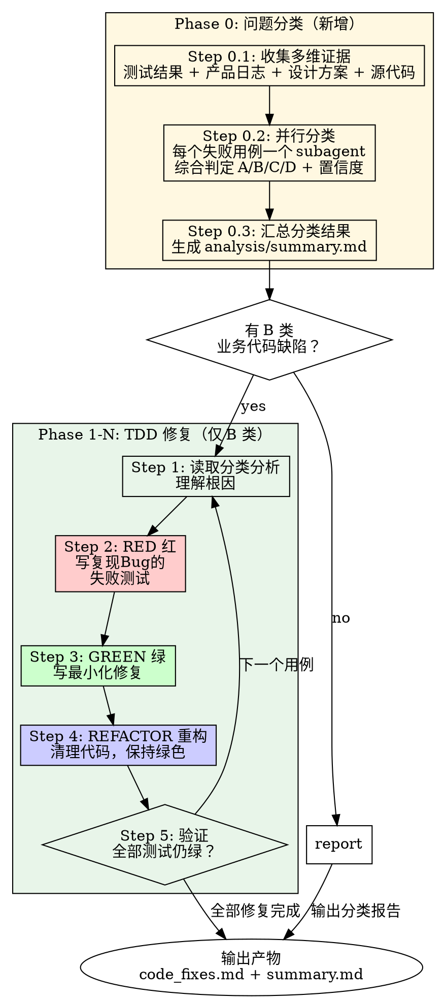

# auto-fix

**职责边界**: `auto-fix` 负责两阶段工作：(1) **Phase 0 — 问题分类**：综合测试执行数据、产品运行日志、设计方案、源代码等多维信息，将失败用例分类为 A/B/C/D；(2) **Phase 1-N — TDD 修复**：仅对 B 类（业务代码缺陷）执行 TDD 红-绿-重构修复循环。A/C/D 类问题输出分类报告，交由人工处理。

## 概述

接收 `auto-test` 产出的测试执行数据，先进行多维信息综合分类，再对 B 类失败执行 TDD 修复。

**核心原则:** 精准分类是精准修复的前提。多维证据交叉验证，分类置信度不足时不上手修复。

## 适用场景

由 `auto-test` 在测试执行完成后调用：
- 测试执行已完成，存在失败用例需要分类和修复
- 修复范围在当前工作区内

**不适用于**（以下场景不由 auto-fix 处理）：
- **A 类—用例步骤描述问题** → 分类报告中标注，需人工修改用例
- **C 类—环境/数据问题** → 分类报告中标注，需人工排查环境
- **D 类—MCP工具问题** → 分类报告中标注，需排查MCP Server（仅 MCP/TP 路径）

## 输入

来自 auto-test 测试执行：

| 输入 | 来源 | 说明 |
|-------|--------|------|
| `task_dir` | auto-test | `.cospowers/auto-test/tasks/{task_dir}/` — 任务工作目录 |
| `{task_dir}/case_status.json` | 执行结果 | 全量用例执行状态 |
| `{task_dir}/output.xml` / `{task_dir}/failed_tests.json` | [RF] | RF 原始输出和关键字调用链 |
| `{task_dir}/{caseCode}_detail.json` | [MCP] | 各失败用例详情（步骤、操作、截图引用） |
| `{task_dir}/mcp_logs_{caseCode}.log` | [MCP] | MCP Server 日志 |
| `{task_dir}/analysis/screenshots/` | [MCP] | 失败步骤截图 |
| `{task_dir}/task_config.yaml` | auto-test 配置 | 测试床、服务器信息（供获取日志） |
| `testbed` | auto-test 配置 | 部署验证所需的测试床信息 |
| `repo` | 当前 worktree | Git remote、分支、服务名称 |

## 工作流程



---

## Phase 0：问题分类

在 TDD 修复之前，先对全部失败用例进行多维信息综合分类。分类结果决定后续处理路径：
- **B 类 → 进入 Phase 1 TDD 修复**
- **其他 → 写入分类报告，不自动修复**

### Step 0.1：收集多维证据

对每个失败用例，收集以下四类证据：

#### ① 测试执行证据（必有）

读取任务目录下的测试结果文件：
- **RF 路径**：`case_status.json` + `output.xml` + `failed_tests.json`（关键字调用链）
- **MCP/TP 路径**：`case_status.json` + `{caseCode}_detail.json`（步骤-操作详情）+ `analysis/screenshots/{caseCode}/`（截图）+ `mcp_logs_{caseCode}.log`（MCP日志）

从测试结果中提取：失败步骤/关键字、错误信息、操作参数、截图内容。

#### ② 产品运行日志（必有）

每个失败用例分类前**必须**读取产品运行时日志。优先探索 cospowers 产品线插件中具备日志收集能力的技能，并调用该技能获取日志并存放于 `.cospowers/auto-test/tasks/{task_dir}/logs/` 目录下，auto-fix 直接读取即可。

如果 `logs/` 目录为空或不存在，在分类报告中标注"日志缺失"，置信度自动降级为低。

日志分析要点：
- 是否有异常堆栈、panic、error 日志 → 倾向 B 类
- 是否有**外部**连接超时、服务不可用 → 倾向 C 类
- 日志中是否显示请求正常处理但返回值异常 → 倾向 B 类

#### ③ 设计方案（按需读取）

读取项目中的设计文档，对照理解预期行为：

- 查找 `docs/agent-rules/3-system-design/output/<module>` 目录下的设计文档
- 通过 `daedalus-knowledge` 技能检索相关技术方案
- 读取 OpenAPI/Proto 定义，确认接口预期行为

设计文档分析要点：
- 接口的预期输入输出 → 判断断言期望值是否合理（A vs B）
- 数据模型定义 → 判断返回数据是否符合设计（B vs C）
- 业务流程定义 → 判断测试步骤是否与设计一致（A vs B）

#### ④ 源代码（按需读取）

当证据指向 B 类时，读取相关源代码确认缺陷位置(代码索引 `doc/codebase/SUMMARY.md`)：

- 根据失败关键字/API路径定位相关代码模块
- 检查代码逻辑是否与设计方案一致
- 确认 Bug 的具体位置和修复范围

### Step 0.2：并行分类

对每个失败用例启动一个独立 subagent 进行分类。使用 Agent 工具(`general-purpose`)，单条消息中并行发起（最多 10 个），超过则分批。

**每个 subagent 的 prompt 模板**：

读取 `skills/auto-fix/agents/failure-classifier.md`，将其中 `${task_dir}` 替换为当前任务目录、`${caseId}` 替换为用例 ID、`${framework}` 替换为框架类型（rf/mcp），然后作为 subagent prompt 使用。

### Step 0.2.5：A 类复核

所有归为 A 类的用例需经过额外交叉验证，防止将代码行为变更误判为用例问题：

1. **检查设计文档支持度**：归为 A 类要求设计文档**明确**支持测试的期望值（不能仅因"没有设计文档"就默认测试期望是错的）
   - 无设计文档或设计文档未明确该行为 → 标注"设计文档缺失"，置信度降级，考虑转为 B 类
2. **检查代码版本变更**：通过 `git log` 检查相关代码是否有近期变更导致行为变化
   - 有变更记录显示相关代码被修改 → 强烈倾向 B 类（代码行为变更）
3. **检查测试用例的假设基础**：测试期望值是否基于已过期的行为假设
   - 测试基于旧版系统行为（如已从 CGI 迁移到 REST API），而系统已升级 → 倾向 B 类（代码行为变更未同步文档）

**A 类转换规则**：若 A 类判定置信度低于 70%，自动转为 B 类并标注"分类不确定，建议人工复核确认"。B 类误判为 A 类的后果（代码 bug 被掩盖、回归测试失效）远重于 A 类误判为 B 类（触发代码审查后可修正方向）。

### Step 0.3：汇总分类结果

所有 subagent 返回后，在主会话中：

1. 收集各 subagent 的 JSON 摘要
2. 生成汇总报告 `.cospowers/auto-test/tasks/{task_dir}/analysis/summary.md`
3. 按分类统计 B 类用例清单，准备进入 TDD 修复

**汇总报告格式**：详见 `../auto-test/references/unified-config.md` §5（`analysis/summary.md` 统一格式）。

### 分类标准

统一分类标准（含典型特征、辅助证据与处置规则）详见 `../auto-test/references/unified-config.md` §5。

**分类判断优先级**（多维证据综合）：
1. 产品日志中有异常堆栈/panic + 接口返回异常 → **B 类**（高置信度）
2. 错误信息包含 timeout/502/503/connection refused + 日志中服务未启动 → **C 类**
3. 设计文档明确预期行为 + 测试断言与设计一致 + 实际结果不对 → **B 类**
4. 设计文档未明确定义该行为 + 测试断言基于历史版本行为 + 实际返回与历史版本不一致 → **优先归为 B 类**（代码行为变更），除非能明确证明测试期望值本身就是错误的
5. 设计文档明确预期行为 + 测试断言与设计不一致 → **A 类**（需满足 A 类排除规则：设计文档明确支持测试期望值、代码逻辑审查确认符合设计意图、断言值可独立验证为不合理——至少满足两项）
6. MCP 工具调用且入参正确但内部异常 + 日志中有工具内部错误 → **D 类**
7. 关键字为 SeleniumLibrary 且错误为元素/定位相关 → 检查日志和代码判断 A 还是 B

**A/B 不确定时的默认方向**：当多维证据不足以在高置信度下区分 A/B 类时，优先归为 B 类。详见 `failure-classifier.md` 中的"A 类排除规则"和"分类不确定性规则"。

---

## Phase 1-N：TDD 修复循环（仅 B 类）

以下步骤仅对分类为 B 类的失败用例执行。在**分析完所有失败用例**后，统一修复代码，然后再进入下一轮TDD循环。

### 步骤 1：读取分类分析

从 `.cospowers/auto-test/tasks/{task_dir}/analysis/{caseCode}.md` 读取该用例的分类分析报告：
- 理解 Bug 的精确面貌：什么失败了、预期与实际结果、涉及哪个代码路径
- 定位目标函数/模块及具体缺陷
- 验证理解：能否用一句话说清楚这个 Bug？

**闸门:** 如果分析未能明确识别缺陷位置和预期行为，返回 Phase 0 补充证据。不可猜测。如果无法获取更多证据，则标注为低置信度，需要人工介入处理。

### 步骤 2：RED 红 — 写失败测试

写一个最小化测试，精确复现分类分析中的 Bug。

```
规则:
- 每次迭代只写一个测试
- 测试必须因 Bug 存在而失败（不是拼写错误）
- 使用真实代码，非 mock，除非依赖本身就是 Bug 源头
- 测试名称必须描述 Bug 场景
- 必须引用失败用例编号（如 "复现用例 TC-12345"）
```

**规范参考:** 写测试前先阅读适用规范：
- `rules/testing-standards/单元测试规范.md` — 三高优先级、测试设计方法
- 语言特定: `rules/testing-standards/Go单元测试规范.md` 或 `rules/testing-standards/Python单元测试规范.md`

### 步骤 3：验证 RED — 亲眼看到失败

**强制步骤。绝不跳过。**

运行测试，确认：
- 测试失败（不是出错 — 是断言失败，不是语法错误）
- 失败信息与分类分析中的 Bug 场景吻合
- 是因为 Bug 存在而失败，不是因为测试自身有 Bug

测试直接通过？说明测试没有复现 Bug。重写。
测试报错？修复测试错误，重新运行，直到正确失败。

### 步骤 4：GREEN 绿 — 写最小化修复

写最简单、最少行的代码使测试通过。

```
规则:
- 一次只改一处
- 能少写就少写
- 不重构其他代码
- 不加新功能
- 不"顺手优化"
```

**规范参考:** 阅读 `rules/coding-standards/`：
- `code-review-error-rules.md` — 安全、异常处理、资源管理等 E 类规则
- 语言特定 checklist

### 步骤 5：验证 GREEN — 亲眼看到通过

**强制步骤。**

```bash
# 运行新测试 — 必须通过
# 运行改动包的全量测试 — 必须全部保持绿色
```

确认：
- 新测试通过
- 所有已有测试仍然通过
- 无新增警告或错误

测试失败？修代码，不要修测试。
其他测试出现回归？在继续前先修复。

### 步骤 6：REFACTOR 重构 — 清理代码

仅在全部绿色后执行：
- 消除修复引入的重复代码
- 改进不清晰的命名
- 如测试 setup 重复，提取辅助函数
- 全程保持全部测试绿色

不添加行为。不扩大范围。

### 步骤 7：继续下一个用例

如果存在多个 B 类用例，返回步骤 1 处理下一个。

## 多用例优化

当存在多个 B 类失败时：

1. 按依赖排序：先修复底层 Bug（可能引发其他失败的根因 Bug）
2. 每个用例完成完整 TDD 循环后再开始下一个
3. 每次修复后，重跑全部新测试以捕获交互问题
4. 两个用例共享同一根因时，一次修复覆盖两个 — 用两个测试分别验证

## 输出

所有输出写入 `.cospowers/auto-test/tasks/{task_dir}/analysis/`：

```
.cospowers/auto-test/tasks/{task_dir}/analysis/
├── summary.md               # 分类汇总报告（Phase 0 产出）
├── {caseCode}.md            # 各失败用例独立分类报告（Phase 0 产出）
└── code_fixes.md           # 代码修复记录（Phase 1-N 产出）
```

### 分类报告格式（summary.md）

详见 `../auto-test/references/unified-config.md` §5。

### 修复记录格式（code_fixes.md）

```markdown
# 代码修复记录

## 修复 1: {caseCode} — {一句话 Bug 描述}

### 分类依据
- 分类: B 类—业务代码缺陷
- 置信度: {百分比}
- 关键证据: [测试结果 + 日志/设计文档/代码分析摘要]

### RED 红 — 失败测试
- 失败验证: [命令 + 输出摘要]

### GREEN 绿 — 最小化修复
- 改动文件: [清单]
- 改动摘要: [一句话]

### 验证
- 新测试: 通过
- 包内测试: [N] 条，全部通过
- 无回归

### 风险评估
- 可能影响: [诚实评估]
- 未覆盖的边界情况: [如有]
```

## 质量关卡

- [ ] Phase 0 分类已完成，每个失败用例有独立分类报告
- [ ] 分类引用了多维证据（测试结果 + 产品运行日志 + 至少一种辅助证据源）
- [ ] `analysis/summary.md` 已生成，含 A/B/C/D 分类统计
- [ ] B 类用例：每个修复都有复现精确 Bug 的失败测试（RED 已验证）
- [ ] B 类用例：每个修复使用最小化代码变更（GREEN 已验证）
- [ ] B 类用例：全部新测试通过 + 已有测试无回归
- [ ] 代码符合 `rules/coding-standards/code-review-error-rules.md`
- [ ] 修复记录已写入 `analysis/code_fixes.md`
- [ ] A/C/D 类问题已在 `summary.md` 中明确标注，含处置建议
- [ ] 未改动无关文件，无"顺手"优化

## 红色警报 — 立即停止

- 测试在修复前就通过 → 测试没有复现 Bug
- 无法写出隔离 Bug 的测试 → 可能需要先重构设计
- 修复涉及 3 个以上不相关文件 → 很可能是根因判断错误
- 3 次尝试修复仍未通过 → 升级给用户，可能是架构问题
- 分类置信度低于 50% 且无法获取更多证据 → 标记为"待人工分析"
- "这个太简单不需要测试" → 这是找借口，写测试

## 需要避免的反模式

| 反模式 | 正确做法 |
|--------|------|
| "修复很明显，跳过测试吧" | 没有测试就无法验证修复。明显的修复也会搞坏东西。 |
| "我修完再补测试" | 事后写的测试直接通过。你永远看不到它捕获 Bug。 |
| "已有测试已经覆盖了" | 如果覆盖了，Bug 就不会存在。写一个专属的回归测试。 |
| "所有修复共用一个测试" | 每个 Bug 需要自己的回归测试。合并测试会掩盖失败。 |
| "修的同时顺便重构一下" | 关注点分离。先修 Bug，绿了再重构。 |
| "不查日志就判断是B类" | 必须收集多维证据交叉验证，避免将环境问题误判为代码缺陷。 |
| "分类置信度低也硬修" | 置信度不足时优先补充证据（日志/设计文档），而不是猜测修复。 |


## 关联技能

- **systematic-debugging** — 复杂缺陷的根因调查方法
- **test-driven-development** — TDD 方法论参考
- **daedalus-knowledge** — 检索设计文档和技术方案
- **verification-before-completion** — 提交前验证
- **code-compliance-check** — 提交前 lint 与规范检查
- **auto-test** — 调用方：编排完整自动化测试闭环
