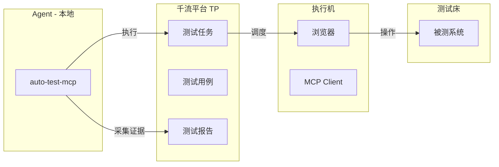

# /auto-test-mcp

**Skill 标识**: `auto-test-mcp`

## 命令功能

通过千流平台 TP 执行测试任务，记录全量用例执行结果，采集原始证据（截图、MCP日志等）供下游 `auto-fix` 进行分类与修复。

**职责边界**：
- **本技能负责**：测试执行、结果记录、原始证据采集（用例详情、截图、MCP日志）
- **本技能不负责**：失败分类（由 `auto-fix` 完成）、代码修复（由 `auto-fix` 完成）、用例修改（A 类人工处理）、环境修复（C 类人工处理）、MCP工具修复（D 类人工处理）、重试编排（由 `auto-test` 统一入口处理）

## 适用场景

- 需要触发 TP 平台测试任务并产出标准化执行数据
- 作为 `auto-test` 统一入口的 MCP/TP 执行引擎被调用
- 修复代码后需要验证是否通过 E2E 测试

## 使用示例

```
/auto-test-mcp <TP平台链接>
/auto-test-mcp <TP平台链接> --case-ids case1,case2
/auto-test-mcp --task-dir <已有任务目录>   # 读取已有结果，重新执行测试
```

## 输入

用户传入的参数直接透传给 `qianliu-aitest`：
- TP 平台链接
- 指定用例范围（`--case-ids`）
- 或已有任务目录（`--task-dir`，跳过执行直接分类）

## 工作原理

单阶段流程：**执行**（TP 平台跑用例 + 获取结果 + 采集原始证据），产出标准化数据供 `auto-fix` 使用。



## 产品架构背景

本产品采用 **微服务架构，K8s 部署**，由多个 Pod 组成。通常一个代码仓库对应一个 Pod。

**关键原则**：
- **不必事先确定代码仓库信息**：启动时无需预先收集 Git 仓库、分支等信息
- **按需获取**：`auto-fix` 在执行分类和修复时，从当前工作目录获取仓库信息
- **跨仓库协同**：E2E 测试失败可能涉及多个微服务，分类时需考虑跨仓库依赖

## 启动前：信息预收集

### 配置存储规范

所有配置统一存储在 **项目级目录**（`.cospowers/auto-test/config.yaml`），切换工作目录后每个项目独立配置。配置结构详见 `@references/config-schema.md`。

### 收集流程

**第 0 步：依赖检查**

**① MCP 服务检查**：

| MCP 服务 | 用途 | 配置位置 |
|---------|------|---------|
| `qianliu-ci` | CI 打包 | `~/.claude/.claude.json` |

检查 `~/.claude/.claude.json` 中 `mcpServers` 是否包含 `qianliu-ci`。若缺失，自动追加：
```json
{
  "mcpServers": {
    "qianliu-ci": {
      "type": "streamableHttp",
      "url": "http://10.74.167.79:9000/mcp"
    }
  }
}
```

**② Skill 依赖检查**：

| Skill | 用途 | 检查方式 |
|-------|------|---------|
| `qianliu-aitest` | TP 测试任务调度 | 目录存在 |
| `qianliu-tp` | TP 用例查询 | 目录存在 |
| `ferret` | 远程命令执行 | 见下方 ferret 检查逻辑 |

- `qianliu-aitest` / `qianliu-tp` 缺失时自动安装：
  ```bash
  npx ainative@latest install skill http://code.sangfor.org/20036/qianliu-skills:qianliu-aitest
  npx ainative@latest install skill http://code.sangfor.org/20036/qianliu-skills:qianliu-tp
  ```

- **ferret 检查逻辑**：按优先级查找：
  1. `~/.claude/plugins/` 下搜索 `*/cospowers/*/skills/ferret/SKILL.md`
  2. `~/.claude/skills/ferret/SKILL.md`
  3. 任一路径存在即可

**第 1 步：加载已有配置 + 自动探测**

1. 读取 `.cospowers/auto-test/config.yaml`，若存在则加载已有值作为默认
2. 读取当前工作目录下的 `tp-aitest-config.yaml`（若存在），填充 `tp_task` 字段
3. 如果 `testbed.ip` 字段为空，从 `testbed_name` 提取 IP（如 `SUT_10.0.0.1 → 10.0.0.1`），写入 `testbed.ip`
4. 检查 ferret 的 `bin/config.json` 中是否已配置目标测试服务器。若未配置则自动添加：
```bash
node <ferret skill目录>/scripts/ferret.js add-server --name <name> --host <ip> --user <ssh_user> --password <ssh_password> --port <ssh_port> --remote-root <root_dir>
```

**第 2 步：交互式确认**

按 `@references/confirmation-prompt.md` 中的固定格式向用户确认信息。

**第 3 步：验证连通性**

1. 通过 ferret 验证测试床 SSH 连通性
2. 验证 `~/.qianliu/config.json` 中的 TP token 存在

任何验证失败都立即报告给用户并终止。

**第 4 步：展示确认清单**

格式见 `@references/launch-checklist.md`。用户确认后进入执行流程。

---

## 测试执行

### 文件覆盖策略

每轮测试执行产出的文件使用**覆盖式**命名，不使用 `_r{N}` 后缀：
- `{caseCode}_detail.json`、`mcp_logs_{caseCode}.log` — 每轮覆盖上一轮
- `case_status.json` — 每轮覆盖上一轮

轮次间的统计数据通过 `round_stats.json` 追踪（详见 `../auto-test/references/unified-config.md` §7）。

### 步骤 1：执行 TP 测试任务

通过 `qianliu-aitest` 技能调度 TP 平台测试：

```
调用 Skill 工具：
  skill: "qianliu-aitest"
  args: "{用户原始参数}"
```
等待测试完成，获取测试报告。

### 步骤 2：获取全量用例状态

从 `qianliu-aitest` 任务目录读取 `case_status.json`，获取全量用例执行状态。

若文件不存在，通过 `qianliu-tp` 查询并生成。

获取后复制到本地任务目录：

```bash
cp <qianliu-aitest任务目录>/case_status.json .cospowers/auto-test/tasks/{task_dir}/case_status.json
```

`case_status.json` 结构：

```json
{
  "task_dir": "{task_dir}",
  "framework": "mcp",
  "executed_at": "{yyyy-MM-dd HH:mm:ss}",
  "total": 10,
  "passed": 7,
  "failed": 3,
  "passRate": 70.0,
  "cases": [
    {
      "caseCode": "tc_LongTemplate_FUNC_001",
      "caseName": "用例名称",
      "caseId": 167540,
      "status": "PASS"
    },
    {
      "caseCode": "tc_LongTemplate_FUNC_002",
      "caseName": "用例名称",
      "caseId": 167541,
      "status": "FAIL"
    }
  ]
}
```

### 步骤 3：初始化 dashboard_data.json

写入 `.cospowers/auto-test/tasks/{task_dir}/dashboard_data.json`：

```json
{
  "framework": "mcp",
  "task_dir": "{task_dir}",
  "executed_at": "{yyyy-MM-dd HH:mm:ss}",
  "rounds": [
    {
      "round": 1,
      "total": 10,
      "passed": 7,
      "failed": 3,
      "passRate": 70.0,
      "executed_at": "{yyyy-MM-dd HH:mm:ss}"
    }
  ],
  "analysis": null,
  "fixes": null
}
```

### 步骤 4：写入 task_config.yaml

写入 `.cospowers/auto-test/tasks/{task_dir}/task_config.yaml`：

```yaml
framework: mcp
task_dir: {task_dir}
tp_url: "{用户传入的 TP 链接}"
created_at: "{yyyy-MM-dd HH:mm:ss}"
```

### 步骤 5：采集失败用例证据（供 auto-fix 使用）

若 `case_status.json` 中 `failed > 0`，对每个失败用例采集原始证据：

**5a. 获取失败用例详情**：

```bash
node {skill目录}/scripts/fetch_failed_details.js .cospowers/auto-test/tasks/{task_dir} --case-code {caseCode} 2>/dev/null > .cospowers/auto-test/tasks/{task_dir}/{caseCode}_detail.json
```

detail JSON 结构：
- `caseCode`、`caseName`、`caseStatus`
- `caseSteps[]` — 步骤列表
  - `stepIndex`、`stepType`（execute/check）
  - `stepContent` — 步骤描述
  - `actions[]` — 操作列表
    - `actionDesc`、`actionStatus`（success/fail）
    - `actionResult` — 执行结果详情
    - `beforeScreenshot`、`afterScreenshot` — 截图 URL
    - `thought` — AI agent 思考过程
    - `toolName`、`toolParam` — 调用的 MCP 工具信息

**5b. 下载截图**：

```bash
mkdir -p .cospowers/auto-test/tasks/{task_dir}/analysis/screenshots/{caseCode}
curl -s -o ".cospowers/auto-test/tasks/{task_dir}/analysis/screenshots/{caseCode}/step{stepIndex}_{stepType}_a{actionIndex}_before.png" "{beforeScreenshot URL}"
curl -s -o ".cospowers/auto-test/tasks/{task_dir}/analysis/screenshots/{caseCode}/step{stepIndex}_{stepType}_a{actionIndex}_after.png" "{afterScreenshot URL}"
```

**5c. 查询 MCP 日志**（涉及"调用工具"的失败步骤时必须执行）：

```bash
node {skill目录}/scripts/fetch_mcp_logs.js --keyword "{工具名关键词}" --lines 200 2>/dev/null > .cospowers/auto-test/tasks/{task_dir}/mcp_logs_{caseCode}.log
```

### 步骤 6：全部通过则提前结束

若 `case_status.json` 中 `failed === 0`，全部用例通过，直接跳到 [产物汇总](#产物汇总)，无需进入分类修复流程。

---

## 产物汇总

所有产出数据写入 `.cospowers/auto-test/tasks/{task_dir}/`，目录结构详见 `../auto-test/references/unified-config.md` §2。

`auto-fix` 将读取以下文件进行分类和修复：
- `case_status.json` — 全量用例执行状态
- `{caseCode}_detail.json` — 各失败用例详情（步骤、操作、截图引用）
- `mcp_logs_{caseCode}.log` — MCP Server 日志（涉及工具调用时）
- `analysis/screenshots/{caseCode}/` — 失败步骤截图
- `task_config.yaml` — 任务配置（含 testbed 信息，供获取日志）

## 质量关卡

- [ ] TP 测试任务已执行完成（无论通过/失败）
- [ ] `case_status.json` 已生成，包含全量用例状态
- [ ] 若存在失败用例，`{caseCode}_detail.json` 已获取
- [ ] 若涉及"调用工具"失败，MCP 日志已获取
- [ ] `dashboard_data.json` 已初始化

## 需避免的反模式

- **跳过连通性验证**：不要在 ferret/TP 未验证可达前启动
- **在本技能中修复代码或分类**：代码修复和失败分类是 `auto-fix` 的职责，本技能仅负责执行和证据采集
- **在本技能中修改用例**：用例修改需人工介入，不可自动修改
- **遗漏原始证据**：截图和 MCP 日志是 auto-fix 分类的关键证据，必须完整采集
- **跳过 MCP 日志查询**：涉及"调用工具"的失败步骤必须查询 MCP 日志

## 中断与恢复

- 执行完成后：结果已保存，用户可直接查看 `case_status.json`
- 证据已采集，可供 `auto-fix` 读取进行分类
- 可通过 `--task-dir` 传入已有目录，重新执行测试

## 注意事项

- 闭环启动前必须完成全部信息预收集和连通性验证
- 所有远程执行必须通过 ferret 技能，禁止使用 ssh/scp 命令行
- 所有任务数据仅保存在本地任务目录，不上报远程服务器
- 执行完成后，由 `auto-fix` 读取产物进行分类和修复
- 分类标准见 `../auto-test/references/unified-config.md` §5
