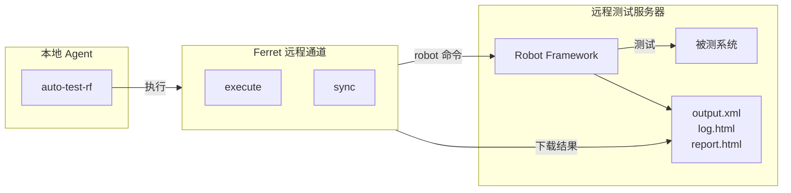

# /auto-test-rf

**Skill 标识**: `auto-test-rf`

## 命令功能

在远程测试环境中执行 **Robot Framework** 测试，记录全量用例执行结果，产出标准化的执行数据供下游 `auto-fix` 进行分类与修复。

**职责边界**：
- **本技能负责**：测试执行、结果记录、原始证据采集（output.xml、log.html、report.html）
- **本技能不负责**：失败分类（由 `auto-fix` 完成）、代码修复（由 `auto-fix` 完成）、用例修改（A 类人工处理）、环境修复（C 类人工处理）、重试编排（由 `auto-test` 统一入口处理）

## 铁律

```
没有 E2E 验证 = 不可合入

RF 测试未通过 → 代码不可合入。
测试执行必须完整记录所有用例状态和原始输出，不可遗漏。
```

## 适用场景

- 在远程测试环境中执行 Robot Framework 测试并产出标准化执行数据
- 作为 `auto-test` 统一入口的 RF 执行引擎被调用
- 修复代码后需要验证是否通过 E2E RF 测试

## 使用示例

```
/auto-test-rf --server testbed --dir /opt/rf-tests
/auto-test-rf --server testbed --dir /opt/rf-tests --include smoke
/auto-test-rf --server testbed --dir /opt/rf-tests --test "Login.*"
/auto-test-rf --task-dir <已有任务目录>   # 读取配置重新执行
```

## 输入

用户传入的参数：
- `--server`：ferret 远程服务器名称（必填）
- `--dir`：远程 Robot Framework 测试目录（必填，首次使用时）
- `--include` / `--exclude` / `--test` / `--suite`：Robot Framework 标准筛选参数
- `--task-dir`：已有任务目录（使用已有配置重新执行或仅做分类）

## 工作原理

单阶段流程：**执行**（远程跑用例 + 下载结果），产出标准化数据供 `auto-fix` 使用。



## 启动前：信息预收集

闭环启动前，必须收集全部所需信息，确保执行过程中不再需要用户介入。

### 配置存储规范

所有配置统一存储在 **项目级目录**（`.cospowers/auto-test/config.yaml`），切换工作目录后每个项目独立配置。配置结构和目录规范详见 `@references/config-schema.md`。

### 收集流程

**第 0 步：依赖检查**

**① Ferret 技能检查**：

ferret 是远程命令执行通道，按以下优先级查找：
1. cospowers 插件内置路径：在 `~/.claude/plugins/` 下搜索 `*/cospowers-*/skills/ferret/SKILL.md`
2. 独立安装路径：`~/.claude/skills/ferret/SKILL.md`
3. 项目内路径：`skills/ferret/SKILL.md`
4. 任一路径存在即可。若均不存在则报错提示用户安装 ferret

验证：调用 `node <ferret skill目录>/scripts/ferret.js list` 确认 ferret 可用。

**② 远程服务器配置检查**：

检查 ferret 的 `bin/config.json` 中是否已配置目标测试服务器。若未配置则自动添加：
```bash
node <ferret skill目录>/scripts/ferret.js add-server --name <name> --host <ip> --user <ssh_user> --password <ssh_password> --port <ssh_port> --remote-root <root_dir>
```

**第 1 步：加载已有配置 + 自动探测**

读取 `.cospowers/auto-test/config.yaml`，若文件存在则加载已有值作为默认

**第 2 步：交互式确认**

按 `@references/confirmation-prompt.md` 中的固定格式向用户确认信息。

**第 3 步：验证连通性**

1. 通过 ferret 验证远程服务器 SSH 连通性：
   ```bash
   node <ferret skill目录>/scripts/ferret.js test --server <server_name>
   ```
2. 验证 Robot Framework 已安装在远程服务器上：
   ```bash
   node <ferret skill目录>/scripts/ferret.js execute "python3 atcli.py --help" --server <server_name>
   ```
3. 验证 `.robot` 测试文件存在：
   ```bash
   node <ferret skill目录>/scripts/ferret.js execute "ls {casedir}/*/*.robot" --server <server_name>
   ```

任何验证失败都立即报告给用户并终止。

**第 4 步：展示确认清单**

所有信息收集和验证完成后，向用户展示最终确认清单（格式见 `@references/launch-checklist.md`）。用户确认后，将配置写入 `.cospowers/auto-test/tasks/{task_dir}/task_config.yaml`

```yaml
framework: rf
task_dir: {task_dir}
server: {server_name}
casedir: {casedir}
created_at: "{yyyy-MM-dd HH:mm:ss}"
```
然后进入执行流程。

---

## 测试执行

### 文件覆盖策略

每轮测试执行产出的文件使用**覆盖式**命名，不使用 `_r{N}` 后缀：
- `output.xml`、`log.html`、`report.html` — 每轮覆盖上一轮
- `case_status.json`、`failed_tests.json` — 每轮覆盖上一轮

轮次间的统计数据通过 `round_stats.json` 追踪（详见 `../auto-test/references/unified-config.md` §7）。

### 步骤 0：生成RF任务配置

1. 本地调用 `gen_build_config.js` 生成 `build_config.yaml`，自动从 `.cospowers/auto-test/config.yaml` 读取 `rf.workflow` 字段值：

```bash
node skills/auto-test-rf/scripts/gen_build_config.js {task_dir}
```

生成的文件位于 `.cospowers/auto-test/tasks/{task_dir}/build_config.yaml`。

2. 上传到远程服务器：

```bash
node <ferret skill目录>/scripts/ferret.js sync --local .cospowers/auto-test/tasks/{task_dir}/build_config.yaml --remote build_config.yaml --server <server_name>
```

### 步骤 1：远程执行 RF 测试

通过 ferret 在远程服务器**后台启动** RF 测试，避免 ferret 单次请求 2 分钟超时导致测试中断。使用 nohup 后台执行 + 轮询等待的异步模式：

**启动测试（后台执行）**：

```bash
# 清理旧的标记文件
node <ferret skill目录>/scripts/ferret.js execute "rm -f /tmp/rf_done /tmp/rf_exit_code /tmp/rf_build.log" --server <server_name>

# 后台启动 atcli.py build（ferret 请求秒级返回，不受测试耗时影响）
node <ferret skill目录>/scripts/ferret.js execute "nohup sh -c 'python3 atcli.py build -f build_config.yaml; echo \$? > /tmp/rf_exit_code; touch /tmp/rf_done' > /tmp/rf_build.log 2>&1 &" --server <server_name>
```

**轮询等待完成**：启动 subagent 在后台轮询远端完成状态，仅返回最终结果。

使用 Agent 工具（`general-purpose`），读取 `skills/auto-test-rf/agents/polling-waiter.md` 作为 prompt，替换其中参数后启动 subagent：

| 参数 | 值 |
|------|-----|
| `${server_name}` | 当前任务使用的 ferret 服务器名 |
| `${ferret_skill_dir}` | ferret 技能目录的绝对路径 |

Subagent 返回 `DONE:<exit_code>` 表示测试完成，主会话解析退出码后继续。若返回 `TIMEOUT`，报错终止。

**注意**: robot可能会针对失败用例自动重试，用例通过状态以最终的状态为准，但是用例数据统计要包含所有的用例；

### 步骤 2：下载结果文件

```bash
node <ferret skill目录>/scripts/ferret.js "cat output.xml" --server <server_name> > .cospowers/auto-test/tasks/{task_dir}/output.xml 2>/dev/null && echo "DOWNLOAD_OK" && wc -c .cospowers/auto-test/tasks/{task_dir}/output.xml
node <ferret skill目录>/scripts/ferret.js "cat log.html" --server <server_name> > .cospowers/auto-test/tasks/{task_dir}/log.html 2>/dev/null && echo "DOWNLOAD_OK" && wc -c .cospowers/auto-test/tasks/{task_dir}/log.html
node <ferret skill目录>/scripts/ferret.js "cat report.html" --server <server_name> > .cospowers/auto-test/tasks/{task_dir}/report.html 2>/dev/null && echo "DOWNLOAD_OK" && wc -c .cospowers/auto-test/tasks/{task_dir}/report.html
```

### 步骤 3：解析结果并生成 case_status.json

```bash
node scripts/parse_rf_output.js .cospowers/auto-test/tasks/{task_dir}/output.xml --all 2>/dev/null > .cospowers/auto-test/tasks/{task_dir}/case_status.json
```

`.cospowers/auto-test/tasks/{task_dir}/case_status.json` 结构：

```json
{
  "task_dir": "{task_dir}",
  "framework": "rf",
  "executed_at": "{yyyy-MM-dd HH:mm:ss}",
  "total": 10,
  "passed": 7,
  "failed": 3,
  "skipped": 0,
  "passRate": 70.0,
  "cases": [
    {
      "id": "s1-t1",
      "name": "Login With Valid Credentials",
      "status": "PASS",
      "elapsed": 15500,
      "suite": "Login Tests",
      "suiteSource": "tests/login.robot",
      "tags": ["smoke", "login"],
      "message": ""
    },
    {
      "id": "s1-t3",
      "name": "Login With Invalid Password",
      "status": "FAIL",
      "elapsed": 8200,
      "suite": "Login Tests",
      "suiteSource": "tests/login.robot",
      "tags": ["smoke", "login"],
      "message": "Element with locator 'id:login-btn' not found."
    }
  ]
}
```

### 步骤 4：初始化 dashboard_data.json

从 `case_status.json` 读取用例数据，转换为 Dashboard 兼容格式写入 `.cospowers/auto-test/tasks/{task_dir}/dashboard_data.json`。

**首轮执行**（round=1）：
```bash
node skills/auto-test-rf/scripts/gen_dashboard_data.js {task_dir}
```

**后续轮次**（round=N）：
```bash
# 从 .autotest_round 读取当前轮次，或由 auto-test 编排器传入
node skills/auto-test-rf/scripts/gen_dashboard_data.js {task_dir} --round {N}
```

`--round N`（N>1）时，脚本读取已有 `dashboard_data.json`，从 `case_status.json` 提取当前轮次数据追加到 `rounds[]` 和 `cases[].history[]`。

可选项：

```bash
node skills/auto-test-rf/scripts/gen_dashboard_data.js {task_dir} --name "任务名称" --max-rounds 3 --target-rate 90
```

`.cospowers/auto-test/tasks/{task_dir}/dashboard_data.json` 结构：

```json
{
  "taskId": "{task_dir}",
  "taskName": "{task_dir}",
  "status": "completed|failed",
  "startTime": "{yyyy-MM-ddTHH:mm:ss}",
  "endTime": "{yyyy-MM-ddTHH:mm:ss}",
  "config": {
    "maxRounds": 5,
    "targetSuccessRate": 95,
    "testPlatform": "Robot Framework"
  },
  "summary": {
    "totalRounds": 1,
    "totalCases": 10,
    "initialPassRate": 70.0,
    "finalPassRate": 70.0,
    "fixedCases": 0,
    "codeChanges": 0
  },
  "rounds": [
    {
      "round": 1,
      "startTime": "{yyyy-MM-ddTHH:mm:ss}",
      "endTime": "{yyyy-MM-ddTHH:mm:ss}",
      "totalCases": 10,
      "passed": 7,
      "failed": 3,
      "skipped": 0,
      "fixes": []
    }
  ],
  "cases": [
    {
      "id": "s1-t1",
      "name": "Login With Valid Credentials",
      "module": "Login Tests",
      "finalStatus": "passed",
      "firstFailRound": null,
      "fixedInRound": null,
      "fixType": null,
      "history": [
        {
          "round": 1,
          "status": "passed",
          "error": null,
          "duration": 15500
        }
      ],
      "fixes": []
    }
  ]
}
```

### 步骤 5：收集产品运行日志（必须）

#### 5.1 自动发现日志收集技能

**优先探索 cospowers 产品线插件中具备日志收集能力的技能**：

1. 扫描已安装的 cospowers 产品线插件（命名模式 `cospowers-*`），查找其skills目录中SKILL.md 中包含以下关键词的技能：
   - `日志收集`、`log collect`、`运行日志`、`产品日志`、`诊断日志`
   - `analysis`、`log`、`诊断分析`
2. 若发现匹配技能，使用 Skill 工具调用该技能，传入 `--task-dir {task_dir}`，由该技能负责将产品日志存放到 `.cospowers/auto-test/tasks/{task_dir}/logs/` 目录下
3. 若发现多个匹配技能，按插件优先级选择（cospowers-产品线 > cospowers）

#### 5.2 降级方案：ferret 直接拉取

若无可用产品线技能，通过 ferret 直接从 DUT 收集日志：

```bash
# 查找 DUT 上的产品运行日志文件
node <ferret_skill_dir>/scripts/ferret.js execute \
  "find /data -name '*.log' -newer /tmp/rf_done -mtime -1 | head -20" \
  --server {server_name}

# 创建本地日志目录
mkdir -p .cospowers/auto-test/tasks/{task_dir}/logs

# 下载关键日志文件（根据上一步发现的路径调整）
node <ferret_skill_dir>/scripts/ferret.js execute \
  "tail -n 500 /data/<service>/logs/<log_file>" \
  --server {server_name} \
  > .cospowers/auto-test/tasks/{task_dir}/logs/<service>.log
```

#### 5.3 日志收集结果记录

收集完成后，检查 `logs/` 目录：
- 若目录非空 → 在后续 `auto-fix` 分类时可正常读取，置信度正常
- 若目录为空或不存在 → 在分类报告中标注"产品日志缺失"，置信度自动降级为低

**注意**：日志收集失败**不阻塞**后续流程，但会影响 `auto-fix` 分类的准确性。

### 步骤 6：生成失败用例详情（供 auto-fix 使用）

若存在失败用例，生成 `failed_tests.json` 供 `auto-fix` 分类时使用：

```bash
node scripts/parse_rf_output.js .cospowers/auto-test/tasks/{task_dir}/output.xml 2>/dev/null > .cospowers/auto-test/tasks/{task_dir}/failed_tests.json
```

`.cospowers/auto-test/tasks/{task_dir}/failed_tests.json` 包含每个失败用例的完整关键字调用链（`keywords[]`），每条关键字记录：`name`、`library`、`status`、`args`、`elapsed`、`messages[]`。

### 步骤 7：全部通过则提前结束

若 `case_status.json` 中 `failed === 0`，全部用例通过，直接跳到 [产物汇总](#产物汇总)，无需进入分类修复流程。

---

## 产物汇总

所有产出数据写入 `.cospowers/auto-test/tasks/{task_dir}/`，目录结构详见 `../auto-test/references/unified-config.md` §2。

`auto-fix` 将读取以下文件进行分类和修复：
- `case_status.json` — 全量用例执行状态
- `output.xml` / `log.html` / `report.html` — 原始测试输出
- `failed_tests.json` — 失败用例关键字调用链
- `task_config.yaml` — 任务配置（含 server 信息，供获取日志）

## 质量关卡

- [ ] 远程 RF 测试已执行完成（无论通过/失败）
- [ ] `output.xml`、`log.html`、`report.html` 已下载到本地
- [ ] `case_status.json` 已生成，包含全量用例状态
- [ ] 若存在失败用例，`failed_tests.json` 已生成
- [ ] `dashboard_data.json` 已初始化

## 需避免的反模式

- **跳过连通性验证**：不要在 ferret 未验证可达前启动
- **直连 SSH 绕过 ferret**：禁止使用 `ssh/scp` 命令行直连
- **在本技能中修复代码或分类**：代码修复和失败分类是 `auto-fix` 的职责，本技能仅负责执行和记录
- **自动修改测试用例**：`.robot` 文件已通过评审，不可自动修改
- **遗漏原始输出**：output.xml 是 auto-fix 分类的关键证据，必须完整下载

## 中断与恢复

- 执行完成后：产物已保存，用户可直接查看 `case_status.json`
- `failed_tests.json` 已生成，可供 `auto-fix` 读取进行分类
- 可通过 `--task-dir` 传入已有目录，重新执行测试

## 注意事项

- 所有远程执行必须通过 ferret 技能，禁止使用 ssh/scp 命令行
- 所有任务数据保存在本地 `.cospowers/auto-test/tasks/{task_dir}/` 目录
- `case_status.json` 包含**全量**用例状态（通过+失败+跳过）
- 执行完成后，由 `auto-fix` 读取产物进行分类和修复
- 分类标准见 `../auto-test/references/unified-config.md` §5
