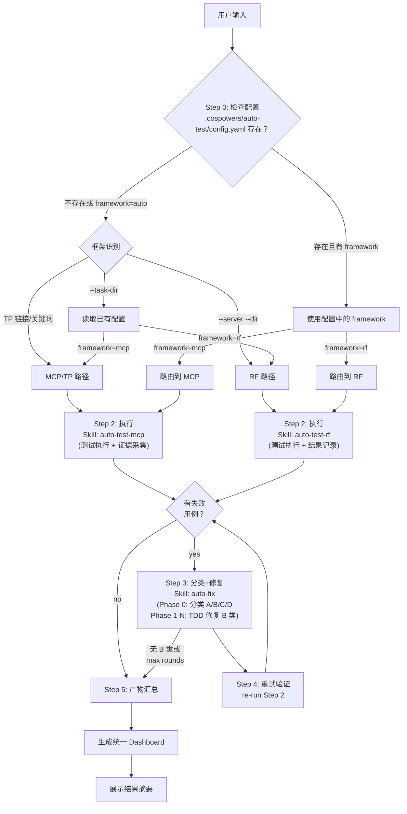

# /auto-test

**Skill 标识**: `auto-test`

## 命令功能

统一自动化测试闭环入口。对外暴露一致的自动测试 & 修复能力，内部根据用户输入自动识别测试框架并路由到对应的执行引擎：

- **MCP/TP 路径**：千流平台 TP 测试任务 → 委托 `auto-test-mcp` 执行测试 + 采集证据
- **RF 路径**：Robot Framework 远程测试 → 委托 `auto-test-rf` 执行测试 + 记录结果

闭环内部分为三个阶段：**执行**（跑用例 + 记录结果 + 采集证据）→ **分类+修复**（`auto-fix` 先综合多维信息分类 A/B/C/D，再对 B 类执行 TDD 修复）→ **重试**。上下游任务无需关注底层使用哪套框架，只需传入测试参数即可获得统一的测试结果和 Dashboard 报告。

## 核心设计原则

### 闭环编排：执行 → 分类+修复 → 重试

`auto-test` 负责编排完整闭环：

1. **框架识别**：根据用户输入判断使用 MCP/TP 还是 RF
2. **用例执行**：通过 `Skill` 工具调用 `auto-test-mcp` 或 `auto-test-rf`，下游技能完成测试执行并采集原始证据（输出文件、截图、日志等）
3. **分类+修复**：委托 `auto-fix` 统一完成：
   - **Phase 0 — 问题分类**：综合测试结果、产品日志、设计方案、源代码等多维信息，将失败用例分类为 A/B/C/D
   - **Phase 1-N — TDD 修复**：仅对 B 类（业务代码缺陷）执行 TDD 代码修复
   - A/C/D 类问题记录到分类报告，不自动修复
4. **重试验证**：修复后重新执行测试，验证通过率提升
5. **产物汇总**：收集所有子技能输出，生成统一 Dashboard

**所有重型执行（测试、分类、修复）均在子技能内部完成，主会话仅负责编排调度和产物汇总。**

## When to Use

- 用户说"跑测试"、"自动测试"、"测试闭环"等关键词
- Plan 中有 E2E 验证步骤需要执行
- 修复代码后需要验证是否通过自动化测试
- 任何需要自动测试 + 失败修复闭环的场景

## 使用示例

```
/auto-test <TP平台链接>                          # → MCP/TP 路径
/auto-test <TP平台链接> --case-ids case1,case2    # → MCP/TP 路径（指定用例）
/auto-test --server testbed --dir /opt/rf-tests   # → RF 路径
/auto-test --server testbed --dir /opt/rf-tests --include smoke  # → RF 路径（筛选 tag）
/auto-test --task-dir <已有任务目录>               # 跳过执行，直接分析已有结果
```

## 框架识别规则

根据用户输入的关键特征自动判断：

| 特征 | 框架 | 委托技能 |
|------|------|---------|
| 包含 `https://tp.` 或 TP 平台链接 | MCP/TP | `auto-test-mcp` |
| 包含 `--server` 和 `--dir` 参数 | Robot Framework | `auto-test-rf` |
| 包含 `--include` / `--exclude` / `--test` / `--suite`（RF 标准参数） | Robot Framework | `auto-test-rf` |
| `--task-dir` 指定已有目录 | 检查目录下 `task_config.yaml` 中的 `framework` 字段 | 按配置路由 |
| 用户明确说 "RF测试" / "robot framework" | Robot Framework | `auto-test-rf` |
| 用户明确说 "TP测试" / "千流平台" | MCP/TP | `auto-test-mcp` |
| 无法判断 | 询问用户确认 | — |

框架识别逻辑详见 `@references/framework-detection.md`。统一配置定义见 `@references/unified-config.md`。

## 统一分类标准

所有路径共享统一的 A/B/C/D 失败分类标准（含典型特征与处置规则），详见 `@references/unified-config.md` §5。

> **扩展性**：如需新增分类（如 E 类），在 `auto-fix` 分类器和 `unified-config.md` 的分类表中同步添加即可。

## 执行流程



### 步骤 0：检查项目级配置文件（必须首先执行）

**在任何框架识别之前，必须先检查项目级配置文件。**

1. 使用 `Read` 工具读取 `.cospowers/auto-test/config.yaml`
2. 若文件存在：
   - 解析 `framework` 字段（`rf` / `mcp` / `auto`）
   - 若 `framework` 为 `rf` 或 `mcp` → **直接使用，跳转到步骤 2**（子技能），不再询问用户框架选择
   - 子技能（`auto-test-rf` / `auto-test-mcp`）调用时自行读取同一配置文件中的 `rf:` / `mcp:` 段
3. 若文件不存在：
   - 告知用户：「未找到项目级配置文件，可创建 `.cospowers/auto-test/config.yaml` 预填参数以跳过后续交互确认」
   - 继续步骤 1（框架识别）

### 步骤 1：框架识别与路由

1. 若步骤 0 已从配置加载 `framework` 且非 `auto`，直接使用
2. 否则解析用户输入，按框架识别规则判断目标框架
3. 若无法判断，使用 `AskUserQuestion` 向用户确认

#### 1.1 生成任务目录名

确定框架后，按 `@references/unified-config.md` §2 定义的命名规范生成 `task_dir`。

#### 1.2 创建任务目录并写入配置

```bash
mkdir -p .cospowers/auto-test/tasks/{task_dir}
```

将框架和任务信息写入 `.cospowers/auto-test/tasks/{task_dir}/task_config.yaml`，格式见 `@references/unified-config.md` §2。

### 步骤 2：用例执行

#### 2.0 记录本轮开始时间戳

在调用下游技能之前，记录本轮开始时间和轮次。**轮次以 `round_stats.json` 为权威来源**（而非 `execution_timing.json`，后者可能因临时文件清理导致计数不准）：

```bash
# 确定当前轮次（首次为 1，重试时自动递增）
# 优先从 round_stats.json 推算（权威来源），回退到 execution_timing.json
ROUND=1
ROUND_STATS=".cospowers/auto-test/tasks/{task_dir}/round_stats.json"
if [ -f "$ROUND_STATS" ]; then
  ROUND=$(node -e "try{const d=require('./$ROUND_STATS');console.log(d.rounds.length+1)}catch(e){console.log(1)}")
else
  TIMING_FILE=".cospowers/auto-test/tasks/{task_dir}/execution_timing.json"
  if [ -f "$TIMING_FILE" ]; then
    ROUND=$(node -e "try{const d=require('./$TIMING_FILE');console.log(d.length+1)}catch(e){console.log(1)}")
  fi
fi
START_TIME=$(date +%s)
echo "$START_TIME" > .cospowers/auto-test/tasks/{task_dir}/.autotest_start_time
echo "$ROUND" > .cospowers/auto-test/tasks/{task_dir}/.autotest_round
```

**轮次连续性校验**：`update_round_stats.js` 在写入时会校验轮次号必须与已有轮次连续（即 `round === rounds.length + 1`），若不连续则报错，防止出现轮次跳跃（如 Round 1 → Round x）。

#### 2.1 调用下游技能执行测试

使用 `Skill` 工具调用 `auto-test-mcp` 或 `auto-test-rf`，透传用户参数。下游技能完成测试执行并采集原始证据（输出文件、截图、日志等），但**不进行失败分类**。

**MCP/TP 路径**：

```
调用 Skill 工具：
  skill: "auto-test-mcp"
  args: "--task-dir {task_dir} {用户原始参数}"
```

**RF 路径**：

```
调用 Skill 工具：
  skill: "auto-test-rf"
  args: "--task-dir {task_dir} {用户原始参数}"
```

#### 2.2 记录本轮结束时间戳与轮次统计

等待技能执行完成后，**记录本轮耗时和轮次统计**：

```bash
node scripts/record-timing.js {framework} {task_dir}
```

然后读取 `.cospowers/auto-test/tasks/{task_dir}/case_status.json` 获取执行结果，**更新 round_stats.json**：

```bash
node scripts/update_round_stats.js {task_dir} --round {当前轮次}
```

此脚本从 `case_status.json` 读取本轮通过/失败数据，追加到 `round_stats.json` 的 `rounds[]` 数组。分类数据（classification）在该轮分类完成后补充。

若全部通过，跳至步骤 5（产物汇总）。

### 步骤 2.5：日志完整性检查（调用 auto-fix 前）

检查 `.cospowers/auto-test/tasks/{task_dir}/logs/` 目录：
- 若目录不存在或为空，且存在失败用例：
  - **RF 路径**：`auto-test-rf` 已在步骤 5 中执行日志收集，但若收集失败，此处为最后兜底。优先探索 cospowers 产品线插件中具备日志收集能力的技能（扫描 `cospowers-*` 插件 SKILL.md 中包含 `日志收集`、`log collect`、`运行日志`、`产品日志`、`诊断日志` 等关键词的技能），调用该技能补全日志
  - **MCP/TP 路径**：`auto-test-mcp` 已在步骤 5c 收集了 MCP Server 日志，但产品运行日志可能仍缺失，同样需探索产品线技能补全
  - 若无可用产品线技能，使用 ferret 直接从 DUT 拉取（见 `auto-test-rf` 步骤 5.2）
  - 若仍无法获取日志，在后续分类报告中标注"产品日志缺失"，分类置信度自动降级为低
- 日志缺失**不阻塞**分类流程，但会导致 `auto-fix` 分类准确性下降（尤其是 A/B 类区分）

### 步骤 3：分类 + 修复（统一委托 auto-fix）

若存在失败用例，调用 `auto-fix` 统一完成分类和修复：

```
调用 Skill 工具：
  skill: "auto-fix"
  args: "--task-dir {task_dir}"
```

`auto-fix` 内部分两阶段：
1. **Phase 0 — 问题分类**：读取测试执行数据，综合产品日志、设计方案、源代码等多维信息，并行 subagent 将每个失败用例分类为 A/B/C/D，生成 `analysis/summary.md` 和各用例独立分类报告 `analysis/{caseCode}.md`
2. **Phase 1-N — TDD 修复**：仅对 B 类用例执行 RED→GREEN→REFACTOR 循环，输出修复记录到 `analysis/code_fixes.md`

A/C/D 类问题不自动修复，仅记录在分类报告中供人工处理。

`auto-fix` 完成后，读取 `.cospowers/auto-test/tasks/{task_dir}/analysis/summary.md` 获取分类汇总，**补充 round_stats.json 中的分类数据**：

```bash
node scripts/update_round_stats.js {task_dir} --round {当前轮次} --update-classification
```

此脚本从 `analysis/summary.md` 解析 ABCD 分类计数，更新 `round_stats.json` 中当前轮次的 `classification` 字段。

### 步骤 4：重试验证

修复完成后，重新执行步骤 2（执行），然后若仍有失败则再次执行步骤 3（分类+修复）。

- 最多重试 3 轮
- 每轮对比通过率，若不再提升则停止
- A/C/D 类用例不参与重试（需人工处理）
- 仅 B 类在新一轮中可能变为通过

### 步骤 5：收集产物并生成 Dashboard

下游技能完成后，主会话：

1. 读取 `.cospowers/auto-test/tasks/{task_dir}/dashboard_data.json` 获取统计数据
2. 读取 `.cospowers/auto-test/tasks/{task_dir}/analysis/summary.md` 获取分类汇总
3. 若经过多轮重试，更新 `dashboard_data.json` 中的 `summary`（totalRounds, finalPassRate, fixedCases, codeChanges）和各轮 rounds 数据
4. 生成统一 Dashboard HTML（使用 `auto-test-dashboard.html` 模板）
5. 向用户展示结果摘要

**多轮数据合并与 Dashboard 生成**：

```bash
node skills/auto-test/scripts/generate_dashboard.js --task-dir {task_dir}
```

此脚本依次执行：
1. 扫描 `round_*_data.json` 合并多轮数据到 `dashboard_data.json`
2. 读取 `dashboard_data.json` 和 `case_status.json`，注入模板生成 `dashboard.html`

### 步骤 6：展示结果摘要

按 `@references/unified-config.md` §6 定义的格式向用户展示结果摘要。

## 产物结构

详见 `@references/unified-config.md` §2（统一运行时目录结构）。

## 质量关卡

- [ ] 重试后测试通过率较首次执行有提升（或全部通过）
- [ ] B 类代码修复路径：修复已部署并验证
- [ ] A/C/D 类问题已在 auto-fix 输出的分类报告中明确标注，等待人工处理
- [ ] 本地保留完整的分析报告和修复记录
- [ ] Dashboard HTML 已生成且可正常打开

## 需避免的反模式

- **跳过框架识别直接假设**：必须先解析用户输入确定框架，不可默认假设为某一套
- **主会话直接执行重型任务**：完整的测试闭环必须在子技能中执行，主会话仅负责路由和产物汇总
- **使用 Agent 工具启动 subagent**：必须使用 `Skill` 工具直接调用下游技能，避免 subagent 嵌套
- **使用 _r{N} 后缀保留每轮报告文件**：每轮报告文件应使用覆盖式命名（标准文件名），轮次统计数据通过 `round_stats.json` 追踪
- **忽略子技能失败**：下游技能返回失败状态时，必须读取已有产物文件，尽可能生成部分 Dashboard
- **混用两套框架的配置**：MCP 和 RF 的配置独立管理，不要交叉引用
- **越权修复**：只有 B 类问题由 `auto-fix` 自动修复，A/C/D 类必须人工介入

## 中断与恢复

用户可在任意阶段中断流程：

- 框架识别后、调用下游技能前：用户可修改框架选择
- 下游技能运行中：用户中断后，可通过 `--task-dir` 恢复（产物已保存）
- 下游技能完成后：用户可直接查看 `.cospowers/auto-test/tasks/{task_dir}/` 下的产物

## 注意事项

- `auto-test` 本身是薄路由层，不包含具体测试执行、分类或修复逻辑
- `auto-test-mcp` 和 `auto-test-rf` 各自完成"执行+证据采集"
- `auto-fix` 统一完成"分类+修复"，分类标准在 `auto-test`、`auto-fix`、`unified-config.md` 中保持一致
- D 类（MCP工具问题）仅在 MCP/TP 路径出现
- 框架识别规则中的关键词匹配优先于默认行为
- Dashboard 模板统一使用 `skills/auto-test/auto-test-dashboard.html`
- 所有任务数据保存在本地 `.cospowers/auto-test/tasks/{task_dir}/` 目录
