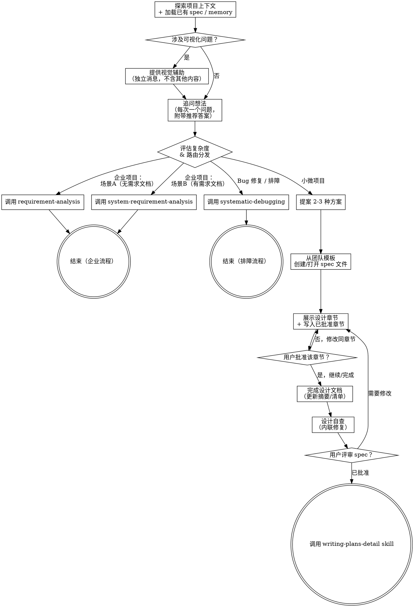

# Brainstorming —— 中央路由器 + 轻量设计工坊

**Skill 标识**: `brainstorming`

其他 skill 通过 `brainstorming` 引用本 skill。

brainstorming 是所有开发工作的入口，承担两个职责：

- **路由器**：对所有项目，先理解上下文、追问想法、评估复杂度，然后分发到合适的工作流管线
- **设计工坊**：仅对小微项目，在 Phase 3 直接产出设计文档（使用微设模板），再交接给 implementation

<HARD-GATE>
在完成 Phase 1（共享发现）、评估项目复杂度、向用户确认路由、并分发到正确的下游管线之前，禁止调用任何实现 skill、编写任何代码、搭建任何项目框架、或采取任何实现行动。适用于所有项目，无论看起来多简单。
</HARD-GATE>

## 反模式：跳过路由直接实现

每个项目都要经过路由流程。Todo 列表、单函数工具、配置修改——无一例外。跳过路由环节是最浪费工作的做法，因为未审视的假设会导致大量返工。完成 checklist，评估复杂度，执行路由——禁止跳过路由直接进入实现。

---

## 一、Phase 1：共享发现（所有路由共用）

你必须为以下每项创建任务，并按顺序完成：

1. **恢复会话上下文（如适用）** —— 如果 session-context 目录中存在 `active-*.md` 文件，必须先调用 `session-context` skill 完成盘点，决定是恢复已有任务还是开始新任务。只有盘点完成后方可进入步骤 2。
2. **探索项目上下文** —— 检查文件、文档、近期 commit；搜索团队知识库（`daedalus-knowledge`）查找相关方案。同时查看已有的领域文档：
   - `docs/agent-rules/specs/` —— 已有设计文档；阅读相关文档以了解先前的决策和既定术语
   - `memory/` —— 过往会话积累的项目级知识（反馈、架构决策、领域事实）
3. **提供视觉辅助**（如果话题涉及可视化问题）—— 这是独立消息，不能和澄清问题合并。参见下方"视觉辅助"章节。
4. **追问想法** —— 对方案的每个方面进行深入追问。遍历设计树的每个分支，逐一解决决策之间的依赖关系。对于每个问题，**先给出你的推荐答案**，然后等待反馈再继续。应用全部四种追问技巧（见下方"追问技巧"章节）。
5. **评估复杂度** —— 确定项目类型和流程（见下方"复杂度评估"章节），然后进入 Phase 2 路由分发。

---

## 二、复杂度评估

在理解项目上下文之后、提案方案之前，评估复杂度：

### 小微项目
> 走轻量管线：brainstorming Phase 3 直接产出设计文档，使用 `templates/micro-design-template.md`，不走企业级完整管线。

**边界：**
- ✅ 单模块，不涉及跨模块交互
- ✅ 范围小（简单功能新增、小范围调整、配置修改、Bug 修复类功能增强，或全新小项目/原型/独立小服务）
- ❌ 单模块但需求复杂、体量大（如模块重构、大型功能新增）→ 走企业级管线
- ❌ 多模块或跨模块交互 → 走企业级管线
- ❌ 排查和修复已知 Bug → 走排障管线

**路由**：Phase 1（共享发现）→ Phase 3（轻量设计）→ `writing-plans-detail` → 执行

### 企业级团队项目
- 企业级、多服务、团队协作项目
- 需要正式交付物（需求文档、设计文档）
- **路由**：两个场景——分发前确定适用哪个：

  **场景 A —— 尚无用户需求文档**
  用户有原始想法、会议记录、口头需求、或非正式的 PRD，尚未形成正式文档。
  → 问一个澄清问题确认："你是否已有书面用户需求文档（结构化格式，产品团队产出）？"
  → 如否：**调用 `requirement-analysis`，brainstorming 结束。**

  **场景 B —— 已有用户需求文档**
  产品团队已产出结构化需求文档（有编号章节、功能/非功能分类、验收条件、或业务场景描述——至少满足其中 2 项）。
  → 如是：**调用 `system-requirement-analysis`，brainstorming 结束。** 禁止调用 `requirement-analysis`。
  → 告知用户："你已有用户需求文档，我将直接进入系统需求分析。"

### Bug 修复 / 排障
- 用户报告 bug、错误、测试失败、或异常行为
- 任务是排查和修复，而非构建新功能
- **路由**：立即调用 `systematic-debugging`，**brainstorming** 结束。

---

## 三、Phase 2：路由分发

根据复杂度评估结果，**必须先向用户确认再执行路由。禁止不经确认直接分发：**

1. **向用户说明你的评估结论和推荐的路由，确认用户认可后再分发**
2. 按以下路由表执行：

| 项目类型 | 路由操作 |
|---------|----------|
| **企业项目 A**（无用户需求文档） | 调用 `requirement-analysis`，**brainstorming** 结束 |
| **企业项目 B**（已有用户需求文档） | 调用 `system-requirement-analysis`，**brainstorming** 结束 |
| **Bug 修复 / 排障** | 调用 `systematic-debugging`，**brainstorming** 结束 |
| **小微项目** | 继续下方 **Phase 3：轻量设计** |

---

## 四、Phase 3：轻量设计（仅小微项目执行）

> ⚠️ 仅当 Phase 2 判定为「小微项目」时执行本节步骤 6-12。

6. **提案 2-3 种方案** —— 提案前，调用 `daedalus-knowledge` 搜索相关架构指南和团队标准（从 `cospowers.config.json` 读取 `SPEC_DEVELOPER_SERVER_URL`；如未配置则跳过）。然后提出 2-3 种方案，附带各自的权衡分析和推荐方案；如适用，参照 DFX 7 维度进行评估（安全性、可靠性、性能、可运维性、可测试性、兼容性、隐私/数据安全）。
7. **增量展示设计并同步编写 spec 文件** —— 在展示第一个设计章节之前，从团队模板创建目标 spec 文件，路径为 `docs/agent-rules/specs/YYYY-MM-DD-<主题>-design.md`（或用户指定路径）。然后逐章节设计：展示内容 → 获取用户批准 → 立即将该章节写入/更新到 spec 文件，再进入下一章节。**禁止等到最后才创建或保存文件。** **设计文档必须遵循 `templates/micro-design-template.md`**。
8. **完成设计文档** —— 到这一步时，spec 文件已存在并已逐章节增量写入。完成剩余的附录/checklist 内容，更新摘要/目录，确保文件完整。遵循 `templates/micro-design-template.md`（双路径：补丁/功能，附录自带自检清单）。此时不要 commit —— 在步骤 10 用户审批后再 commit。
9. **设计自查与评审** —— 内联检查：占位符、矛盾点、歧义、范围。如使用 micro-design-template，执行其附录自检清单（按补丁/功能类型区分）。然后使用 `skills/brainstorming/agents/spec-document-reviewer-prompt.md` 派发 subagent 评审。

   **评审结果处理：**
   - **Approved** → 进入步骤 10。
   - **Issues Found** → 根据 reviewer 返回的具体问题修复 spec，修复后重新派发 reviewer。**最多 2 轮修复。** 2 轮后仍有 Issues → 向用户展示剩余问题，请用户决定是否继续。
10. **用户评审设计文档** —— 请用户评审 spec 文件后再继续。用户批准后，commit 该 spec。
11. **知识归档** —— 扫描设计 spec 中的可复用知识，向用户展示候选项：

    ```
    📦 知识归档候选项（设计完成）

    扫描到以下设计决策值得归档：
    1. [架构决策] 选用 xxx 而非 yyy（原因：zzz 约束）
    2. [方案取舍] xxx 方案在性能和维护性之间选择了 xxx（原因：yyy）

    请选择要归档的序号（如 1 2），或输入"跳过"不归档。
    ```

    若未发现值得归档的设计决策，仍需告知用户：

    ```
    📦 知识归档候选项（设计完成）

    本次设计为常规模式，未发现对团队有通用复用价值的非显而易见决策。

    如有需要补充归档的内容，请现在告知；否则输入"继续"进入实现阶段。
    ```

    用户确认后，对选中条目调用 `daedalus-knowledge` 执行归档。

12. **交接实现阶段** —— 调用 `writing-plans-detail` skill 创建实现计划。禁止调用任何其他 skill——`writing-plans-detail` 是唯一的下一步。


## 流程全景图



**终端状态取决于项目类型：**
- **小微项目**：终端状态为调用 `writing-plans-detail`。禁止调用任何其他实现 skill，唯一的下一步是 `writing-plans-detail`。
- **企业级团队项目**：终端状态取决于场景：
  - 场景 A（无需求文档）：调用 `requirement-analysis`，调用后 brainstorming 结束。
  - 场景 B（有需求文档）：调用 `system-requirement-analysis`，调用后 brainstorming 结束。
- **Bug 修复 / 排障**：终端状态为调用 `systematic-debugging`，**brainstorming** 结束。

## 追问技巧

四种技巧在步骤 4 中全程应用。它们不是顺序阶段——根据每个问题的特性选用合适的技巧。

**1. 对照已有 spec 挑战术语**

当用户使用的术语与已有 spec（`docs/agent-rules/specs/`）中的定义冲突时，立即指出："先前设计将'取消'定义为 X，但你似乎指的是 Y——到底是哪个？" 当术语模糊或过载时，提出精准的规范术语："你说'账号'——是指客户还是用户？它们是不同的概念。"

术语确定后，立即记录到当前会话的 `active-*.md`（通过 session-context）和正在编写的设计文档中。跨 spec 集的一致性比单个文件更重要。

**2. 用具体场景做压力测试**

讨论领域关系时，构造具体场景来探测边缘情况，迫使用户精确界定概念边界。场景必须足够具体，能回答：在这个确切情况下会发生什么？

**3. 与代码交叉验证**

当用户描述某功能如何运作时，探索代码库进行验证。如发现矛盾，直接指出来："你的代码取消的是整个订单，但你刚才说部分取消是支持的——哪个是对的？" 如果问题可以通过探索代码库来回答，就不要问用户。

**4. 谨慎使用 ADR**

只有当以下三个条件全部满足时才提议 ADR：
1. **难以逆转** —— 改变主意的代价是显著的
2. **不解释会很奇怪** —— 未来的读者会问"为什么这样做？"
3. **存在真实的取舍** —— 有真正的替代方案，且出于特定原因选择了其中一个

三个条件任一不满足，跳过 ADR。

当 ADR 有必要时：
- 保存到 `docs/agent-rules/specs/adr/NNNN-<决策简述>.md` —— 扫描目录中最大已有编号，加 1
- 遵循 `skills/brainstorming/ADR-FORMAT.md` 格式：简短标题 + 1-3 句话（上下文、决策、原因）。可选章节（状态、考虑的方案、后果）仅在确实有价值时添加
- `adr/` 目录按需创建 —— 只在第一个 ADR 需要时才建立

---

## 核心原则

- **先推荐，再提问** —— 每个问题必须附带你的推荐答案；绝不只提问不给建议
- **一次一个问题** —— 不要一次性抛出多个问题
- **尽量提供选项** —— 选择题比开放式问题更容易回答
- **严格 YAGNI** —— 从所有设计中删除不必要的功能
- **探索替代方案** —— 小微项目 Phase 3 中，做决定前提出 2-3 种方案
- **增量验证** —— 展示设计，获批准后再继续
- **保持灵活** —— 当发现不对时回溯和澄清
- **立即澄清语言** —— 出现模糊或冲突的术语时当场解决，记录到 active-*.md
- **代码优于假设** —— 如果代码库能回答的问题，检查代码而不是去问
- **ADR 是稀有事件** —— 只有三个条件全部满足时才创建（难以逆转、不解释会很奇怪、存在真实取舍）

## 视觉辅助

一个基于浏览器的辅助工具，在 brainstorming 过程中展示 mockup、图表和视觉选项。它是一个工具，不是一种模式。接受视觉辅助表示它对有视觉价值的问题可用，但不意味着每个问题都要通过浏览器。

**提供视觉辅助：** 当你预计后续问题涉及可视化内容（mockup、布局、图表），发一次消息征求同意：
> "我们接下来要讨论的一些内容，用浏览器展示可能更容易理解。我可以边做边展示 mockup、图表、对比图等视觉辅助。这个功能还在测试阶段，可能消耗较多 token。想试试吗？（需要打开本地 URL）"

**此邀请必须是独立消息。** 不能与澄清问题、上下文摘要或任何其他内容合并。消息中只能包含以上邀请，不能有其他内容。等待用户回复再继续。如果用户拒绝，继续进行纯文本的 brainstorming。

**逐问题判断：** 即使用户接受了，也要逐问题决定使用浏览器还是终端。判断标准：**用户看到比读到更容易理解吗？**

- **使用浏览器** 展示可视化内容——mockup、线框图、布局对比、架构图、并列视觉设计
- **使用终端** 展示文本内容——需求问题、概念选择、取舍清单、A/B/C/D 文本选项、范围决策

如果用户同意使用视觉辅助，在继续前阅读详细指南：
`skills/brainstorming/references/visual-companion.md`


## 路由速查

Phase 2 的路由决策汇总：

| 项目类型 | 后续步骤 |
|---------|---------|
| **企业项目 A**（无需求文档） | 向用户确认后，调用 `requirement-analysis` |
| **企业项目 B**（有需求文档） | 向用户确认后，调用 `system-requirement-analysis` |
| **Bug 修复 / 排障** | 向用户确认后，调用 `systematic-debugging` |
| **小微项目** | 向用户确认后，继续 Phase 3（步骤 6-12），用户批准 spec 后调用 `writing-plans-detail` |
