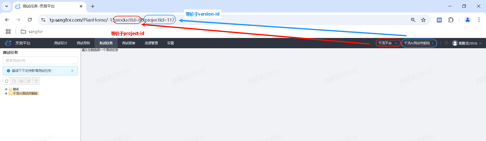
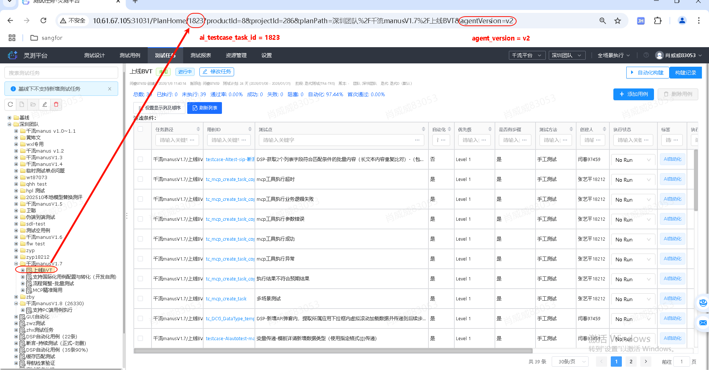

# TP 平台配置指引

本文档说明如何在 TP 平台上快速获取所需的配置参数。

> 💡 **提示**：本指引与 SKILL.md 中的自动引导配置流程相配合。你可以选择：
> - **方式一**：直接跟随引导式配置
> - **方式二**：参考本文档手动获取各参数

完整配置示例请参考：[`tp-aitest-config.example.yaml`](tp-aitest-config.example.yaml)

---

## 任务配置参数概览

| 参数名 | 来源 | 说明 |
|--------|------|------|
| `tp_base_url` | 从任务链接自动提取 | TP 平台地址（内网或公网） |
| `project_id` | 任务链接 `productId` 参数 | 项目标识 |
| `version_id` | 任务链接 `projectId` 参数 | 版本标识 |
| `ai_testcase_task_id` | 任务链接路径中的 ID | AI 测试用例任务 ID |
| `agent_version` | 任务链接 `agentVersion` 参数 | Agent 版本（可选，默认 `v1`） |
| `testbed_name` | ResourceHome 测试床选项卡 | 测试床名称 |
| `exec_host_name` | ResourceHome 执行主机选项卡 | 执行主机标签 |

---

## 步骤 1：获取全局 Token

### Token 存放位置

Token 统一存放在用户全局配置文件中：

- **Windows**: `%USERPROFILE%\.qianliu\config.json`
- **Linux/Mac**: `~/.qianliu/config.json`

### 配置格式

```json
{
  "tp": {
    "token": "your_tp_token_here"
  }
}
```

### 如何获取 Token

📸 **截图位置 1**：TP 平台 链接 `https://tp.sangfor.com/`
   - 通常在：右上角用户头像左侧问号图标 → 复制用户 Token

---

## 步骤 2：获取 project_id 和 version_id

1. 打开 TP 平台：`https://tp.sangfor.com/`
2. 在右上角选择所需项目和版本



3. 查看浏览器地址栏，URL 格式如下：
   ```
   https://tp.sangfor.com/PlanHome/-1?productId={project_id}&projectId={version_id}
   ```
4. 从 URL 中提取两个配置参数：
   - `project_id`（productId 的值）
   - `version_id`（projectId 的值）

---

## 步骤 3：获取 ai_testcase_task_id 和 agent_version

1. 访问测试计划页面：
   ```
   https://tp.sangfor.com/PlanHome/-1?productId={project_id}&projectId={version_id}
   ```
2. 选择可用于自动化执行的测试任务



3. 点击任务后，查看浏览器地址栏，URL 格式如下：
   ```
   https://tp.sangfor.com/PlanHome/{ai_testcase_task_id}?productId={project_id}&projectId={version_id}&agentVersion={agent_version}&...
   ```
4. 从 URL 中提取配置参数：
   - `ai_testcase_task_id`（路径中 `/PlanHome/` 后的数字）
   - `agent_version`（`agentVersion` 查询参数的值，如 `v2`；若 URL 中没有此参数，可不填，默认使用 `v1`）

---

## 步骤 4：获取 testbed_name

1. 进入资源管理页面：
   ```
   https://tp.sangfor.com/ResourceHome?productId={project_id}&projectId={version_id}
   ```
2. 点击 **"测试床（被测设备信息）"** 选项卡
3. 新增或选择一条测试床记录，将测试床名称作为 `testbed_name`

---

## 步骤 5：配置 exec_host_name

1. 在同一资源管理页面上选择 **"AI自动化执行主机"**
2. 完成主机配置
3. 设置统一的标签（Tag）
4. 将该标签名称作为配置参数 `exec_host_name`


## 步骤 6：填写配置文件

将以上获取的所有参数填写到配置文件中：

### 配置文件位置

```
{项目目录}/.qianliu/.qianliu-aitest/tp-aitest-config.yaml
```

### 完整配置示例

参考完整示例：[`tp-aitest-config.example.yaml`](tp-aitest-config.example.yaml)

```yaml
tp_platform:
  # 从任务链接提取
  project_id: 8                     # ← 填写你的 project_id
  version_id: 286                   # ← 填写你的 version_id
  ai_testcase_task_id: 1823         # ← 填写你的 ai_testcase_task_id
  agent_version: "v2"               # ← 可选，填写 agentVersion 参数值；不填则默认 v1

  # 从 ResourceHome 获取
  testbed_name: "填写测试床名称"      # ← 填写你的测试床名称
  exec_host_name: "小龙虾的自动化主机"                # ← 填写执行主机标签

  # 任务描述（可选）
  desc: ""                          # ← 留空则自动生成
```
