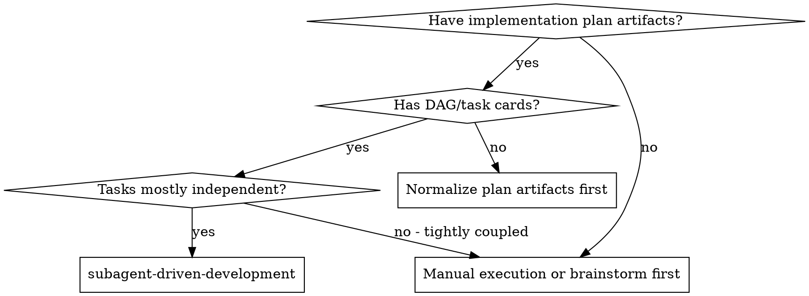
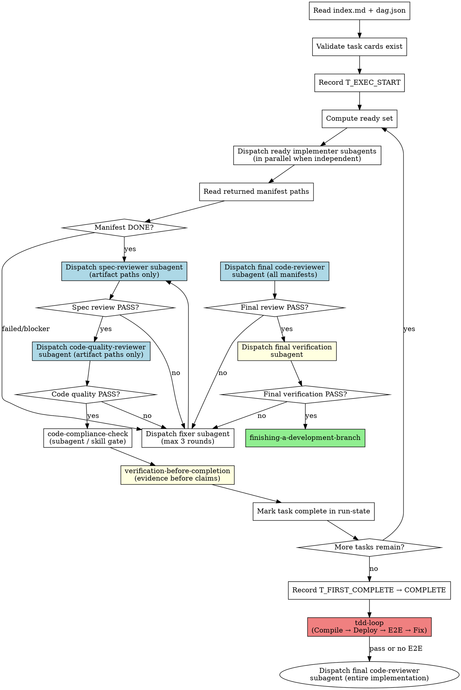

# Subagent-Driven Development

**Skill 标识**: `subagent-driven-development`

其他 skill 通过 `subagent-driven-development` 引用本 skill。

Execute implementation plans by acting as an orchestrator-only main agent: read scheduling artifacts, dispatch fresh subagents for ready tasks, run per-task review gates, then run final review and verification. Subagents exchange context through artifacts on disk, not through main-agent summaries.

**Why subagents:** You delegate tasks to specialized agents with isolated context. Each subagent reconstructs context from artifact paths: DAG, task card, upstream manifests, implementation artifacts, and review reports. The main agent keeps only flow-control state.

**Core principle:** Orchestrator-only main agent + artifact handoff + DAG ready-set parallelism + per-task spec/code review gates + final code review + test verification = high quality, isolated, parallel execution.

## When to Use



## HARD GATE: Orchestrator-only Main Agent

The main agent in this skill only:

1. Reads plan index, `dag.json`, task card paths, manifests, review gate status, and blocker reasons.
2. Computes the current ready set from DAG dependencies and manifest status.
3. Dispatches all independent ready tasks in the same scheduling batch.
4. Dispatches spec reviewer, code quality reviewer, fixer, final reviewer, and verifier subagents by artifact path.
5. Updates task state and escalates blockers after retry limits.

The main agent must not:

- Write implementation code or tests.
- Run task-level implementation commands.
- Paste full plan/task/results text into subagent prompts.
- Read detailed `results.md`, `test-results.md`, or large diffs unless escalating `BLOCKED` / `NEEDS_CONTEXT`.
- Decide implementation correctness directly; reviewer / verifier subagents own that judgment.

## The Process



### Plan Artifact Gate

Before dispatching any implementer subagent, inspect only the scheduling artifacts:

1. `index.md` exists and points to `dag.json` and task cards.
2. `dag.json` exists and each task has `id`, `task_file`, `depends_on`, and `produces`.
3. Every `task_file` exists.
4. Every task card must be independently executable by a subagent and contain acceptance criteria.

If `dag.json` or task cards are missing, dispatch a normalizer subagent to create them from the plan. Do not paste the plan body into implementer prompts.

## Artifact Handoff Contract

### Implementer input

Dispatch implementers with artifact paths only:

```markdown
- DAG file: `.cospowers/plans/YY-MM-DD-<project>/dag.json`
- Task card: `.cospowers/plans/YY-MM-DD-<project>/tasks/<task-id>.md`
- Upstream manifests:
  - `.cospowers/tasks/<upstream-id>/manifest.json`
- Work directory: `<worktree-path>`
```

### Required task artifacts

Every implementer must write:

```text
.cospowers/tasks/<task-id>/manifest.json
.cospowers/tasks/<task-id>/results.md
.cospowers/tasks/<task-id>/contract.json
.cospowers/tasks/<task-id>/changed-files.txt
.cospowers/tasks/<task-id>/test-results.md
```

### Minimal status report

Subagents return only:

```markdown
Status: DONE | DONE_WITH_CONCERNS | NEEDS_CONTEXT | BLOCKED | FAILED
Task: <task-id>
Manifest: .cospowers/tasks/<task-id>/manifest.json
Ready for downstream: true | false
Blocking reason: <one sentence or null>
```

Detailed implementation notes, changed files, tests, contracts, and concerns belong in artifact files and are read by reviewer / verifier subagents.

## DAG Ready-Set Scheduling

1. A task is ready when every dependency manifest has `status == DONE` and `ready_for_downstream == true`.
2. All tasks in the same ready set must be dispatched in the same scheduling batch when their deliverables do not overlap and no task declares exclusive execution.
3. Dependent tasks must not run before upstream manifests are DONE and ready for downstream.
4. If a ready set is empty while unfinished tasks remain, inspect only manifest statuses and blocking reasons, then dispatch fixer / normalizer subagents or escalate to the user.

## ⏱️ Time-Stats Logging (MANDATORY)

subagent-driven-development 启动后必须在两个关键时间点追加写入 `.cospowers/execution/time-stats.log`：

### T_EXEC_START: After loading DAG, before first ready set

```bash
echo "T_EXEC_START: $(date '+%Y-%m-%d %H:%M:%S')" >> .cospowers/execution/time-stats.log
```

### T_FIRST_COMPLETE: After all tasks complete, before COMPLETE handoff

```bash
echo "T_FIRST_COMPLETE: $(date '+%Y-%m-%d %H:%M:%S')" >> .cospowers/execution/time-stats.log
```

> ⚠️ 此文件由 planner 创建（写入 T_TASK_START），executor 追加写入，最终由 committer 读取用于生成 `[TIME-STATS]` 块。三个角色通过此文件传递时间数据，**不可跳过任何打点**。

## Model Selection

Use the least powerful model that can handle each role to conserve cost and increase speed.

| Role | Model |
|------|-------|
| Implementer (1-2 files, complete task card) | cheap model |
| Implementer (multi-file, integration) | standard model |
| Implementer (design judgment, broad codebase) | most capable model |
| Spec reviewer | standard model |
| Code quality reviewer | standard model |
| Final code reviewer | standard model |

## Handling Implementer Status

**DONE:** Read the manifest path, then proceed to Gate 1 (spec-reviewer subagent).
**DONE_WITH_CONCERNS:** Do not read detailed results. Dispatch reviewer / verifier subagents using artifact paths to decide whether concerns block downstream work.
**NEEDS_CONTEXT:** Read only `blocking_reason`, provide missing artifact paths or ask the user for the required decision, then re-dispatch implementer.
**BLOCKED:** Stop downstream dispatch. Provide context, use a more capable subagent, break task smaller through a planner/normalizer subagent, or escalate to user.
**FAILED:** Dispatch fixer subagent using artifact paths. Escalate after 3 rounds.

## Per-Task Review Gates

After implementer finishes a task, dispatch two reviewer subagents in sequence. Each is a **hard gate** — the task is NOT complete until both pass.

### Gate 1: Spec Compliance Review

1. Dispatch spec-reviewer subagent using `./spec-reviewer-prompt.md`.
2. Pass artifact paths only: task card, manifest, results path, changed-files path, test-results path, and upstream manifests.
3. Spec reviewer verifies: implementation matches requirements (nothing missing, nothing extra, no misunderstandings).
4. **Gate outcomes:**
   - **PASS** → proceed to Gate 2 (Code Quality Review)
   - **FAIL** → reviewer writes specific issues to report path → dispatch fixer subagent → re-dispatch spec-reviewer (max 3 rounds per task)
5. After 3 FAIL rounds: `AskUserQuestion` for human intervention.

### Gate 2: Code Quality Review

1. **Only dispatch after Gate 1 PASSES**.
2. Dispatch code-quality-reviewer subagent using `./code-quality-reviewer-prompt.md`.
3. Pass artifact paths only: task card, manifest, review-spec report, results path, changed-files path, and test-results path.
4. Code quality reviewer checks: code structure & architecture, test quality, scenario coverage, fault tolerance, comment quality. **Coding standards (E-rules, language conventions) are enforced by code-compliance-check — NOT re-checked here.**
5. **Gate outcomes:**
   - **PASS** → proceed to code-compliance-check (below)
   - **FAIL** → reviewer writes specific issues to report path → dispatch fixer subagent → re-dispatch code-quality-reviewer (max 3 rounds per task)
6. After 3 FAIL rounds: `AskUserQuestion` for human intervention.

### Code Compliance Check (KB Standards)

After Gate 2 passes, run the unified coding standards check through the appropriate skill/subagent gate:

1. Run `code-compliance-check` skill (KB semantic check → lint auto-fix).
2. Violations block completion.
3. On pass, writes `compliance-cache.json` or the project-standard report artifact.

> This is the single authoritative coding standards check. It covers E-rules, language conventions, naming, formatting, security, logging, error handling — everything that was previously split across red-line self-checks and Gate 2 E-rules checks.

### Verification Before Completion

After code-compliance-check passes:
- Invoke `verification-before-completion` or a verification subagent with artifact paths.
- Mark task complete in run-state only after verification evidence is written.

### Per-Task Retry Loop

```
implementer → spec-reviewer → PASS? ──yes→ code-quality-reviewer → PASS? ──yes→ code-compliance-check → PASS? ──yes→ verification-before-completion → mark complete
                  │no                            │no                              │no
                  ↓                              ↓                                ↓
              fixer subagent                 fixer subagent                  fixer subagent
                  │                              │                                │
                  └── retry (max 3) ────────→ retry (max 3) ──────────────→ retry (max 3)
```

## Post-Completion: E2E Verification → Final Review + Test Verification

After ALL tasks pass both review gates and are marked complete:

1. Record `T_FIRST_COMPLETE` time-stat (see Time-Stats Logging above).
2. Output `COMPLETE` marker.
3. **Dispatch final code-reviewer subagent** for the entire implementation:
   - Use `./final-code-reviewer-prompt.md`.
   - Scope input: `dag.json`, all task manifest paths, `run-state.json`, and `git diff <plan-start-commit>..HEAD` when the reviewer needs repository-level verification.
   - Focus: architecture consistency, cross-task data flow, style uniformity, overall code health, requirements-design coherence, cross-task DFX — issues invisible to per-task reviewers.
   - **Gate**: PASS → proceed to test verification. FAIL → dispatch fixer subagent → re-dispatch final reviewer (max 3 rounds).
4. Execute final test verification through a verification subagent:
   - Run all unit tests: `pytest tests/ -v` or `go test ./... -v`.
   - Run API tests if applicable.
   - Verify normal + boundary + exception scenario coverage.
   - Record results in `.cospowers/execution/final-verification.md`.
5. Execute E2E Verification via tdd-loop (runs once after ALL subtasks)

**E2E is the final verification gate.** It runs ONCE, after all subtasks, with the full requirement scope.

#### Toggle Check

Read `ENABLE_TDD_LOOP` from `<plugin-root>/cospowers.config.json` under the `env` section (default: `false`).

- **If `ENABLE_TDD_LOOP` is `true`** → Execute the E2E verification flow below.
- **If `ENABLE_TDD_LOOP` is `false`** or absent → Skip Step 5 entirely. Announce: "ENABLE_TDD_LOOP is false, skipping E2E verification." Proceed to Step 6.

#### E2E Execution (when enabled)

**Invoke `tdd-loop`** to run the E2E test and fix all failed testcases(compile → deploy → E2E verify → fix → loop).

```
"Execute the CI/CD pipeline via tdd-loop for the implementation in this worktree. 
Compile the code, deploy artifacts, run E2E tests via auto-test, 
fix B类 failures via auto-fix, loop until all E2E pass or max rounds reached."
```

**When `tdd-loop` reports success (status: passed)**, proceed to Step 6.

**If `tdd-loop` reports failure (status: failed after max rounds):**
- Present the failure report to the user.
- Ask: "tdd-loop reached max rounds without all E2E tests passing. Remaining failures: {list}. How would you like to proceed? (continue fixing / commit with known failures / abandon)"
- Do NOT proceed without user decision.

6. **Gate:** All pass → finishing-a-development-branch. Failures → dispatch fixer subagent for affected manifests and restart from affected task's Gate 1 (max 3 full rounds).
7. If issues persist after 3 rounds: `AskUserQuestion` for human intervention.

## Prompt Templates

- `./implementer-prompt.md` - Dispatch implementer subagent
- `./spec-reviewer-prompt.md` - Dispatch spec compliance reviewer subagent (Gate 1)
- `./code-quality-reviewer-prompt.md` - Dispatch code quality reviewer subagent (Gate 2)
- `./final-code-reviewer-prompt.md` - Dispatch final code-reviewer subagent (Post-Completion, cross-task review)

## Red Flags

**Never:**
- Start implementation on main/master branch without explicit user consent
- Skip review gates after task implementation (both gates + code-compliance-check are MANDATORY)
- Skip tdd-loop when ENABLE_TDD_LOOP is true (tdd-loop is MANDATORY when enabled, runs ONCE for the entire requirement)
- Run E2E tests per-task instead of once via tdd-loop (E2E covers the requirement, not individual subtasks)
- Skip final code review after all tasks complete
- Dispatch code-quality-reviewer before spec-reviewer PASSES
- Accept reviewer FAIL without fixing and re-dispatching
- Skip code-compliance-check after Gate 2 PASS
- Skip verification-before-completion after code-compliance-check PASS
- Implement a task whose task card lacks acceptance criteria
- Exceed 3 retry rounds without escalating to user
- Dispatch dependent tasks in parallel before upstream manifests are DONE and ready_for_downstream=true
- Paste full plan/task/results text into Sub Agent prompts instead of passing artifact paths
- Read detailed task results in the main Agent unless handling BLOCKED/NEEDS_CONTEXT escalation
- Ignore subagent questions or blocker reasons
- Move to finishing-a-development-branch before all checks pass

**If subagent asks questions:**
- Answer clearly and completely with paths, decisions, or missing context
- Provide additional context if needed without pasting large artifacts that already exist on disk
- Don't rush them into implementation

**If reviewer finds issues:**
- Dispatch a fixer subagent with artifact paths and review report path
- Re-dispatch reviewer to verify
- Repeat until PASS (max 3 rounds per gate)
- Don't skip the re-review

## Integration

**Required workflow skills:**
- **using-git-worktrees** - REQUIRED: Set up isolated workspace before starting
- **writing-plans** / **writing-plans-brief** - Creates the plan artifacts this skill executes
- **verification-before-completion** - REQUIRED: Evidence before marking task complete (after Gate 2 PASS)
- **tdd-loop** - CI/CD pipeline: compile, deploy, E2E auto-test, fix, loop. MANDATORY when plan includes E2E step.
- **auto-test** - Unified E2E test execution + failure classification (called internally by tdd-loop)
- **auto-fix** - TDD-based code fix for B类 (business code defects, called internally by tdd-loop)
- **requesting-code-review** - Code review template for reviewer subagents (Gate 2 + Final review)
- **finishing-a-development-branch** - Complete development after verification

**Subagents should use:**
- **test-driven-development** - Subagents follow TDD for each task
- **spec-commit** - Implementer subagent commits follow structured commit format
