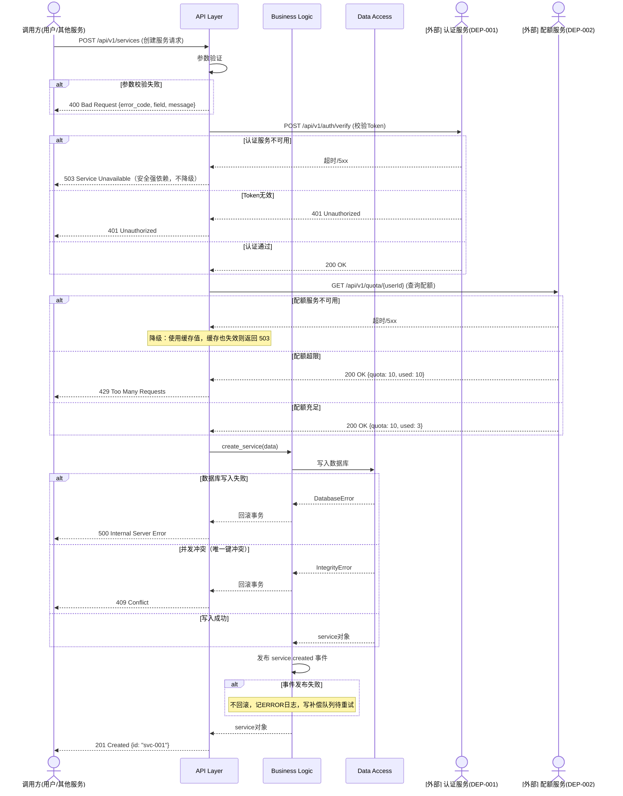

# 4. **内部设计**

## 4.1. **子模块划分**

*描述模块内部如何划分子模块*

### 4.1.1. **子模块清单**

| 子模块名称 | 子模块职责 | 主要类/文件 | 代码位置 |
|---|---|---|---|
| *API Layer* | *处理 HTTP 请求* | *views.py, serializers.py* | *src/api/* |
| *Business Logic* | *业务逻辑处理* | *service.py, manager.py* | *src/services/* |
| *Data Access* | *数据访问* | *models.py, repository.py* | *src/models/* |
| *Utils* | *工具函数* | *utils.py* | *src/utils/* |

### 4.1.2. **子模块依赖关系**

```
┌─────────────┐
│  API Layer  │
└──────┬──────┘
       │
       ▼
┌─────────────────┐
│ Business Logic  │
└──────┬──────────┘
       │
       ▼
┌─────────────────┐
│  Data Access    │
└──────┬──────────┘
       │
       ▼
┌─────────────────┐
│   Database      │
└─────────────────┘
```

## 4.2. **对软件总体架构的影响**

*描述本次新增及调整子模块对软件总体架构的影响点。*

| 情况分类 | 是否对总设有影响 |
|---|---|
| 1 本次新增或调整的子模块对总体架构是否有影响 | *是/否* |
| 2 本次新增或调整的子模块对总体架构有一定程度的影响，但涉及的子模块少于 3 个（如调整了某个基础子模块对外提供服务的方式，由 socket 通信改为了 RPC 调用），请在本章节描述具体的架构改动内容 | *是/否* |
| 3 本次新增或调整的子模块对总体架构有较大影响，需要对原有软件架构进行较大调整或者重新设计，请重新做总体设计 | *是/否* |

## 4.3. **流程设计**

*描述模块内部的关键处理流程，每个接口的增删改查流程如涉及非平凡业务逻辑，均需单独描述。*

<span style="color:red">**[文档拆分规则] 当一个模块包含超过 2 组增删改查接口（即 2 个以上独立的资源/业务域）时，说明该模块职责过重，必须按业务子模块拆分为多份子文档：`模块级设计文档——XX子模块.md`。每个子文档独立描述该子模块的流程设计、数据结构、异常处理等（结构与本模板一致）。本文档仅保留子模块拆分总览和跨子模块交互设计。**</span>

<!--
【拆分判断标准】
- ≤ 3 组增删改查接口：在本文档中完整描述所有流程，无需拆分
- > 3 组增删改查接口：必须拆分，示例：
  · 模块级设计文档——服务管理子模块.md（服务的增删改查 + 生命周期管理）
  · 模块级设计文档——任务调度子模块.md（任务的增删改查 + 调度逻辑）
  · 模块级设计文档——配额管理子模块.md（配额的增删改查 + 计费逻辑）

【拆分后本文档保留内容】
- §4.1 子模块划分（全局视角）
- §4.2 跨子模块交互流程（如有）
- 各子文档的索引清单（见下方子模块索引表）
-->

**子模块拆分索引（仅拆分时填写，未拆分则删除本表）：**

| 子模块名称 | 子文档名称 | 包含的接口/资源域 | 负责人 |
|---|---|---|---|
| *服务管理* | *模块级设计文档——服务管理子模块.md* | *服务增删改查、生命周期* | *张三* |
| *任务调度* | *模块级设计文档——任务调度子模块.md* | *任务增删改查、调度执行* | *李四* |

<span style="color:orange">**[AI可读性要求] 每个流程必须同时包含：①流程图——正常流程和异常分支画在同一张图中，用 alt/else 块表示异常分支（供人看）②详细步骤表格（供 AI 读，含涉及子模块/类/函数名、异常处理）。函数/方法名必须与实际代码一致。流程设计章节不编写代码示例，代码示例仅在 §4.4 核心算法和公共框架机制中提供。**</span>

### 4.3.1. **流程1：创建服务流程**

**流程描述:**
*用户通过 API 创建服务的完整流程*

**流程图（含正常流程和异常分支）:**

<span style="color:orange">**[图示规范] 时序图中：本模块内部子模块用 `participant`；外部模块/服务用 `actor` 或加前缀 `[外部]` 区分。外部调用步骤的箭头注释中写明接口路径和 DEP-XXX 编号。正常流程为主干，异常分支用 `alt/else` 块就地表示，须覆盖：参数校验失败、权限/认证失败、外部依赖不可用、业务逻辑异常（如并发冲突）、部分成功需回滚等场景。每个异常分支需说明错误码和关键处理动作。**</span>



**详细步骤:**

<span style="color:orange">**[填写规范] 步骤类型分两种，用不同标记区分：`[内部]` 表示本模块内子模块间调用；`[外部]` 表示调用其他模块/服务的接口（必须在 §3.5 中有对应的 DEP-XXX 记录）。外部调用须在"涉及子模块/类"列写明 `DEP-XXX` 编号。异常处理列必须写明：错误码、回滚动作、日志级别。**</span>

| 步骤 | 类型 | 处理内容 | 涉及子模块/类 | 关键代码/接口 | 异常处理 |
|---|---|---|---|---|---|
| 1 | [内部] | 接收 HTTP 请求 | API Layer / ServiceView | `create()` | 参数校验失败返回 400，ERROR 日志 |
| 2 | [内部] | 参数验证 | API Layer / ServiceSerializer | `validate()` | 抛出 ValidationError，返回 400 含具体字段错误 |
| 3 | **[外部]** | 校验用户 Token | **DEP-001** / AuthClient | `POST /api/v1/auth/verify` | Token 无效返回 401；服务不可用返回 503（安全强依赖，不降级） |
| 4 | **[外部]** | 检查资源配额 | **DEP-002** / QuotaClient | `GET /api/v1/quota/{userId}` | 超限返回 429；服务不可用时使用缓存值，缓存失效返回 503 |
| 5 | [内部] | 创建服务记录 | Data Access / ServiceRepository | `create_service()` | 数据库错误回滚事务返回 500；唯一键冲突返回 409 |
| 6 | [内部] | 初始化任务 | Business Logic / TaskManager | `create_task()` | 任务创建失败：回滚步骤5的服务记录，返回 500 |
| 7 | [内部] | 发送事件通知 | Business Logic / EventPublisher | `publish()` | 发送失败不回滚（服务已创建），记 ERROR 日志，写补偿队列 |
| 8 | [内部] | 返回响应 | API Layer / ServiceView | `Response()` | / |

**函数列表:**

*本流程涉及的关键函数。*

<span style="color:orange">**[AI可读性要求] 函数列表用于 AI 编码时精确理解函数签名和约束。参数/返回值需写明类型和取值范围；前置/后置约束条件必须明确。**</span>

| 函数名 | 函数功能 | 参数及返回值 | 说明（包括其它前置/后置约束条件等） |
|---|---|---|---|
| `ServiceView.create` | 接收创建请求并编排流程 | `[in] request: Request` HTTP 请求对象<br>`[out] Response` HTTP 响应 | 前置：请求已通过认证中间件。后置：数据库写入成功或事务回滚 |
| `ServiceSerializer.validate` | 参数校验 | `[in] data: dict` 待校验数据<br>`[out] dict` 校验后数据 | 前置：data 不为空。失败抛出 ValidationError |
| `ServiceRepository.create_service` | 持久化服务记录 | `[in] data: dict` 服务数据<br>`[out] Service` 持久化后的服务对象 | 前置：data 已通过校验。后置：数据库中有对应记录。失败抛出 DatabaseError 或 IntegrityError |

### 4.3.2. **流程2：【流程名称】**

*按相同格式继续描述其他关键流程，每个流程必须同时包含流程图和详细步骤表格。*

## 4.4. **核心算法与公共框架**

*描述模块中的关键算法和公共框架机制。*

<span style="color:orange">**[代码示意要求] 本设计文档中仅以下两种场景允许编写代码示例，其他章节一律不编写伪代码或代码片段：
1. **核心算法**：调度算法、分配算法、匹配算法等需要给出完整实现逻辑
2. **公共框架机制**：如果模块需要提前定义代码结构（如插件机制、事件总线、拦截器链、处理器基类），必须给出类定义和关键方法签名的示例
未涉及的场景标注"不涉及"即可。**</span>

### 4.4.1. **算法1：【算法名称】**

**算法目的:**
*说明该算法要解决什么问题*

**算法描述:**
*用伪代码或流程图描述算法逻辑*

```python
def algorithm_example(input_data):
    """
    算法说明

    Args:
        input_data: 输入数据

    Returns:
        result: 处理结果

    Time Complexity: O(n)
    Space Complexity: O(1)
    """
    # 算法实现
    result = process(input_data)
    return result
```

**性能分析:**

| 场景 | 时间复杂度 | 空间复杂度 | 预期性能 |
|---|---|---|---|
| 最好情况 | *O(1)* | *O(1)* | *< 10ms* |
| 平均情况 | *O(n)* | *O(1)* | *< 100ms* |
| 最坏情况 | *O(n^2)* | *O(n)* | *< 1s* |

*如果最差场景不能达到性能要求，需分析该场景在用户处出现的几率，以及出现该场景对用户造成的负面影响。*

### 4.4.2. **公共框架机制（如有）**

<!--
【填写要求】
如果模块需要定义公共的代码结构、抽象基类、框架机制（如拦截器链、策略模式基类、事件总线等），
在此给出类定义示例，便于团队成员按统一结构开发。不涉及则写明"不涉及"。
-->

**框架说明:**
*说明该框架机制的目的、使用场景*

**类定义示例:**

```python
from abc import ABC, abstractmethod

class BaseHandler(ABC):
    """
    处理器基类 —— 所有业务处理器必须继承此类
    用于统一请求处理链路：参数校验 → 前置检查 → 业务处理 → 后置动作
    """

    @abstractmethod
    def validate(self, request) -> None:
        """参数校验，失败抛出 ValidationError"""
        ...

    @abstractmethod
    def execute(self, request) -> dict:
        """核心业务逻辑，返回处理结果"""
        ...

    def pre_check(self, request) -> None:
        """前置检查（权限、配额等），可选覆盖"""
        pass

    def post_action(self, request, result) -> None:
        """后置动作（审计日志、事件发布等），可选覆盖"""
        pass

    def handle(self, request) -> dict:
        """模板方法，子类不应覆盖"""
        self.validate(request)
        self.pre_check(request)
        result = self.execute(request)
        self.post_action(request, result)
        return result
```

## 4.5. **数据结构设计**

*描述模块使用的关键数据结构*

### 4.5.1. **数据库表设计**

<span style="color:orange">**[AI可读性要求] 直接用 SQL DDL 定义，不用 Markdown 表格。COMMENT 写字段含义，枚举字段列出所有合法值，索引注释说明服务于哪类查询。每张表必须标注所属代码仓库。**</span>

```sql
-- 表：service
-- 用途：存储服务实例信息
-- 所属仓库：repo-service-a
-- 关联状态机：见 openapi.yaml#ResourceStatus

CREATE TABLE service (
  id          VARCHAR(36)   NOT NULL                    COMMENT '服务唯一ID（UUID）',
  name        VARCHAR(100)  NOT NULL                    COMMENT '服务名称，正则：^[a-zA-Z0-9-_]+$',
  description VARCHAR(256)                              COMMENT '服务描述，可为空',
  version     VARCHAR(20)                               COMMENT '服务版本，可为空',
  status      ENUM('disabled','creating','ready','error')
                            NOT NULL DEFAULT 'disabled' COMMENT '服务状态，见openapi.yaml#ResourceStatus',
  config      JSON          NOT NULL DEFAULT '{}'       COMMENT '配置信息，结构见 §4.5.3',
  created_at  DATETIME(3)   NOT NULL DEFAULT CURRENT_TIMESTAMP(3),
  updated_at  DATETIME(3)            ON UPDATE CURRENT_TIMESTAMP(3),

  PRIMARY KEY (id),
  INDEX idx_name       (name)       COMMENT '支持按名称搜索（LIKE查询）',
  INDEX idx_status     (status)     COMMENT '支持按状态过滤列表',
  INDEX idx_created_at (created_at) COMMENT '支持按创建时间排序'
) ENGINE=InnoDB DEFAULT CHARSET=utf8mb4 COMMENT='服务实例主表';
```

**表关系：**

```
service (1) ──< (N) task        service_id → service.id
```

### 4.5.2. **内存数据结构**

*描述在多个软件单元之间传递的数据结构及全局变量。*

**数据结构1：缓存结构**

```python
class ServiceCache:
    """
    服务缓存结构
    使用 LRU 策略，最大缓存 1000 个服务对象
    """
    def __init__(self, max_size=1000):
        self.cache = {}
        self.max_size = max_size
        self.access_order = []

    def get(self, service_id):
        """获取服务"""
        pass

    def set(self, service_id, service):
        """设置服务"""
        pass
```

### 4.5.3. **全局数据结构定义**

*描述在多个软件单元之间传递（如通过函数参数）的数据结构、全局变量、通讯用的消息。*

| 项目 | 内容 |
|---|---|
| 结构说明 | *IP 组，存放一组服务器的 IP* |
| 结构定义 | `struct ip_group {`<br>&nbsp;&nbsp;&nbsp;&nbsp;`size_t cnt;`<br>&nbsp;&nbsp;&nbsp;&nbsp;`unsigned int ips[0];`<br>`};` |

| 字段名 | 取值范围 | 说明 |
|---|---|---|
| *cnt* | *[0, 4K]* | *ips 数组的长度，即里面存放的整数个数* |
| *ips* | *网络字节序的 IP 地址数组* | *IP 地址数组* |

### 4.5.4. **配置文件结构**

*定义相应的配置文件格式，存储方式，存储路径，各字段代表什么意义。*

<span style="color:orange">**[AI可读性要求] 配置文件必须说明：存储路径、格式（yaml/json/ini 等）、每个字段的类型/默认值/取值范围/含义。修改某字段是否需要重启服务必须明确标注。**</span>

**配置文件：service_config.yaml**

*存储路径：/etc/service/config.yaml*

```yaml
service:
  name: "service-name"
  port: 8080
  log_level: "INFO"
  database:
    host: "localhost"
    port: 3306
    name: "service_db"
  cache:
    enabled: true
    ttl: 3600
```

**字段说明:**

| 字段名 | 类型 | 默认值 | 取值范围 | 说明 | 修改后需重启 |
|---|---|---|---|---|---|
| *service.name* | *string* | */* | */* | *服务名称* | *是* |
| *service.port* | *int* | *8080* | *1-65535* | *服务端口* | *是* |
| *service.log_level* | *string* | *INFO* | *DEBUG/INFO/WARNING/ERROR* | *日志级别* | *否（热加载）* |

**配置升级流程（如适用）：**

*如果需要在原有配置文件基础上升级，需描述配置的升级流程。不涉及则删除本段。*

## 4.6. **异常场景处理**

*描述模块如何处理各种异常场景*

### 4.6.1. **异常场景清单**

| 异常场景 | 触发条件 | 影响范围 | 处理策略 | 恢复方式 |
|---|---|---|---|---|
| *数据库连接失败* | *数据库不可用* | *所有数据操作* | *重试 3 次，失败后返回 503* | *数据库恢复后自动连接* |
| *参数验证失败* | *用户输入不合法* | *单次请求* | *返回 400 错误，记录日志* | *用户修正参数重新请求* |
| *权限不足* | *用户无权限* | *单次请求* | *返回 403 错误* | *用户申请权限后重试* |
| *资源配额超限* | *超过配额限制* | *单次请求* | *返回 429 错误* | *等待配额释放或申请扩容* |
| *依赖服务不可用* | *第三方服务故障* | *相关功能* | *降级处理，使用默认值* | *依赖服务恢复后正常* |
| *并发冲突* | *并发修改同一资源* | *单次请求* | *返回 409 错误，提示重试* | *用户重新获取最新数据后重试* |

### 4.6.2. **降级策略**

*描述系统的降级策略*

| 降级场景 | 降级策略 | 影响 |
|---|---|---|
| *缓存服务不可用* | *直接查询数据库* | *性能下降* |
| *消息队列不可用* | *同步处理，不发送消息* | *无异步通知* |
| *第三方 API 不可用* | *返回默认值或缓存值* | *功能受限* |

## 4.7. **设计要点检视**

*本表格作为一个设计要点的检查列表，帮助设计人员回顾相关要点具体是怎么考虑的，是否已经满足需要。相关要点必须体现在本章的各个子章节中（比如结构、流程、函数列表等），表格填写内容仅仅作为一个总结。*

| 检视项 | 说明 |
|---|---|
| 可维护/可调试措施 | *分析开发过程可能遇到的调试难题，描述设计中所提供的解决方案* |
| 可测试性 | *分析测试过程可能遇到的测试难题，描述设计中所提供的解决方案* |
| 自动化测试支持 | *分析该模块如何进行自动化测试，怎么保证自动化测试能够更好验证本模块/类的功能* |
| 可扩展性 | *分析将来版本最有可能发生扩展的特性，说明针对这些扩展保留的设计支持* |
| 稳定性保证措施 | *分析软件运行过程中，该模块容易发生哪些类型异常，给出异常检测、异常恢复措施* |
| 工作量估算 | *对实现本节设计内容需要的工作量进行估算，按人天算* |
