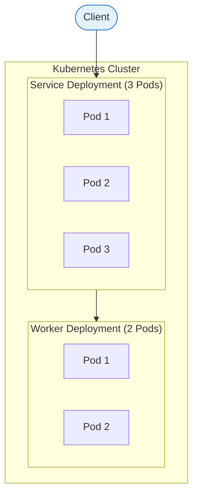

# 7. **部署和发布**

## 7.1. **部署架构**

*使用 Mermaid flowchart 描述本模块的部署架构，禁止用 ASCII 代替。*

**图示（Mermaid示例，按实际替换）：**

## 7.2. **部署清单**

**Kubernetes 资源:**

| 资源类型 | 资源名称 | 说明 |
|---|---|---|
| *Deployment* | *service-deployment* | *Web 服务* |
| *Deployment* | *worker-deployment* | *后台 Worker* |
| *Service* | *service-svc* | *服务暴露* |
| *ConfigMap* | *service-config* | *配置* |
| *Secret* | *service-secret* | *密钥* |

## 7.3. **发布流程**

1. **代码提交:** 提交到 Git 仓库
2. **CI 构建:** Jenkins 自动构建、测试
3. **镜像构建:** 构建 Docker 镜像
4. **推送镜像:** 推送到镜像仓库
5. **部署测试环境:** 自动部署到测试环境
6. **测试验证:** 运行自动化测试
7. **部署生产环境:** 手动审批后部署生产
8. **健康检查:** 验证服务健康状态
9. **灰度发布:** 逐步放量
10. **监控观察:** 观察监控指标
