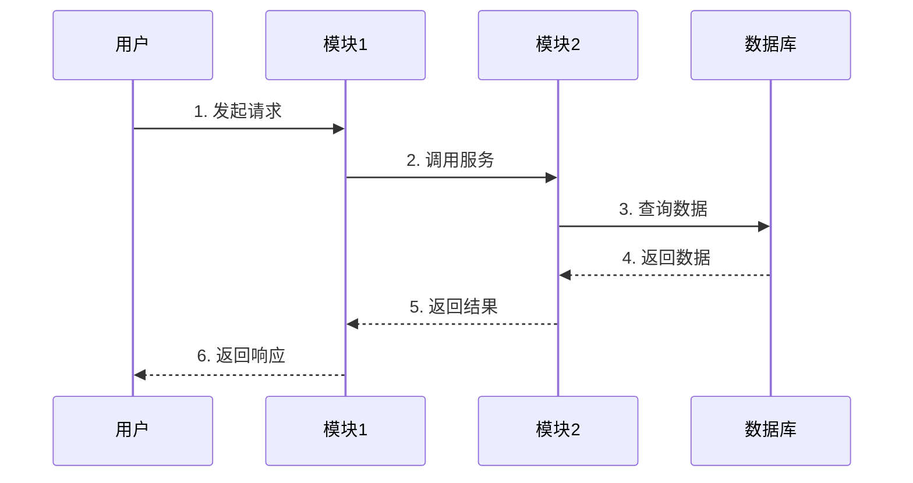

# 4. **系统工作原理**

## 4.0. **工作原理**

*描述系统端到端的数据流/控制流，以及关键处理节点的核心机制。*

> **图示见 [§2.2.2 过程视图](ch02-系统总体架构.md#222-过程视图)。** 过程视图已描述系统运行时如何协作，本章以文字/表格方式对关键机制做补充说明，不重复放图。

**工作原理说明（AI文字描述，必须填写）：**

| 序号 | 阶段/步骤 | 说明 | 关键机制/算法 |
|---|---|---|---|
| 1 | *阶段名称* | *该阶段做什么，输入是什么，输出是什么* | *用到什么核心机制* |
| 2 |  |  |  |

## 4.1. **核心设计思路**

*描述系统的主要工作原理，关键需求的设计思路。*

### 4.1.1. **设计原则**

1. *设计原则1：例如，单一职责原则*
2. *设计原则2：例如，高内聚低耦合*
3. *设计原则3：例如，接口隔离原则*

### 4.1.2. **核心机制**

*描述系统的核心机制，例如：*

1. *认证授权机制*
2. *数据同步机制*
3. *任务调度机制*
4. *故障恢复机制*

## 4.2. **系统主流程**

*主要业务场景的系统流程。通过各模块交互实现系统功能，分析系统流程图导出各模块接口。*

*对于规模较大的版本，整体架构只需定义到子系统一级，系统流程只需描述子系统之间的交互流程和接口。*

### 4.2.1. **系统流程1：【流程名称】**

#### 对应用例编号

*对应需求的USE CASE或功能点编号。需将USE CASE或功能点细化，描述流程运作过程中可能出现的异常场景。*

#### 流程图与步骤说明

*使用时序图描述各模块协作完成对应功能，对每步进行详细说明。流程图需覆盖所有USE CASE或功能点。*

**[AI可读性要求] 每个流程必须同时包含：①时序图（供人看）②步骤说明表格（供AI读）。步骤说明表格必须写明每步的调用方、被调方、接口名称、传递的关键参数和可能的异常。接口调用必须使用标准格式引用：`接口名 (HTTP方法 路径)，详见《API Schema文档》§X.X.X`。**

**关键步骤说明：**

| 步骤 | 调用方 | 被调方 | 接口名称 | 说明 | 异常情况 | 异常处理 |
|---|---|---|---|---|---|---|
| 1 | 用户 | 模块1 | — | *发起请求* | *请求参数不合法* | *返回错误提示* |
| 2 | 模块1 | 模块2 | *接口名 (GET /api/xxx)* | *调用服务* | *模块2不可用* | *返回错误并记录日志* |
| 3-6 | 模块2 | 数据库 | — | *数据查询和返回* | *数据库连接失败* | *重试机制* |

*详细的接口定义参见 API schema 文档*

### 4.2.2. **系统流程2...**

*按上述格式继续描述。*

### 4.2.3. **系统初始化流程**

*描述各模块资源分配、结构初始化过程。*

### 4.2.4. **系统退出流程**

*描述各模块资源销毁过程。*

## 4.3. **系统其它流程**

*非主要业务场景的系统流程。*

### 4.3.1. **系统流程1**

#### 对应用例编号

#### 流程图与步骤说明

#### 关键步骤说明

| 步骤 | 调用方 | 被调方 | 接口名称 | 说明 | 异常情况 | 异常处理 |
|---|---|---|---|---|---|---|
| | | | | | | |

### 4.3.2. **系统流程2...**
