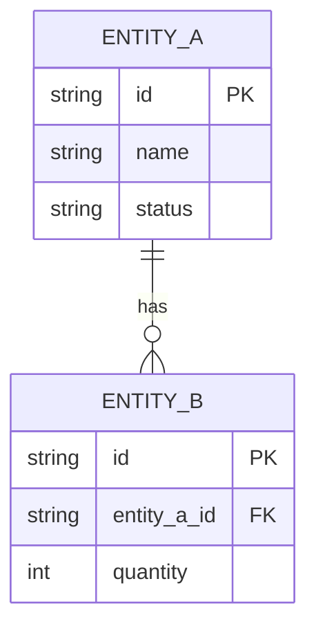

# 5. **模块设计说明**

## 5.1. **设计决策记录**

*记录概要设计中的关键设计决策。技术选型（用什么技术）见 §2.5，本节记录设计决策（怎么用技术）。*

| 设计点 | 选择方案 | 选择理由 |
|---|---|---|
| *例：配额扣减的事务策略* | *TCC 分布式事务* | *强一致性要求，需回滚能力* |
| | | |

## 5.2. **模块静态结构**

*描述系统的软件分层结构，展示各模块/子模块之间的层次和依赖关系。*

> **图示见 [§2.2.4 开发视图](ch02-系统总体架构.md#224-开发视图)。** 开发视图已展示模块的静态组织结构，本章以文字/表格方式对分层和职责做补充说明，不重复放图。

**层次说明（AI文字描述，必须填写）：**

| 层次 | 包含组件 | 职责 | 与其他层的关系 |
|---|---|---|---|
| *接入层* | *API网关、负载均衡* | *流量入口、路由、认证* | *向下调用应用层* |
| *应用层* | *各业务模块* | *业务逻辑处理* | *向上暴露API，向下读写数据层* |
| *数据层* | *数据库、缓存、消息队列* | *数据持久化和异步通信* | *被应用层访问* |

### 5.2.1. **模块1：【模块名称】**

**职责定义:**
*详细说明该模块的职责边界*

**关键数据结构:**
*概要描述该模块涉及的关键数据结构（详细定义在模块级设计文档中给出）*

### 5.2.2. **模块2：【模块名称】**

*按相同格式继续描述其他模块*

## 5.3. **系统数据架构** ⭐必填

*描述系统核心实体、实体间关系，以及模块间交互的数据结构（数据库、共享内存、文件等）。不描述物理表结构——物理 DDL 见各模块级设计文档。*

### 5.3.1. **核心实体关系图** ⭐必填

*展示系统全局核心实体及其关系。*

**[必填图示] 使用 Mermaid erDiagram 绘制，禁止用 ASCII 代替。图后必须附实体说明表。**

**图示（Mermaid示例，按实际替换）：**

**实体说明（AI文字描述，必须填写）：**

| 实体 | 归属模块 | 核心属性（3-5个） | 数据量级估计 |
|---|---|---|---|
| *实体A* | *模块1* | *id, name, status* | *万级* |
| *实体B* | *模块2* | *id, entity_a_id, quantity* | *百万级* |

### 5.3.2. **模块间交互数据结构说明**

*描述各模块间交互的数据结构。建议覆盖：数据流向、调用方式（同步/异步/定时轮询等）、通信协议、消息格式、关键字段（字段名、类型、必填、方向、含义）。*

## 5.4. **模块设计要求**

*汇总各模块的设计目标和约束，为模块级设计文档提供输入。*

| 模块名称 | 设计要求 | 设计策略 |
|---|---|---|
| *模块1* | *性能指标、资源约束等* | *概要设计 / 微型设计 / 不做设计* |
| *模块2* | | |
